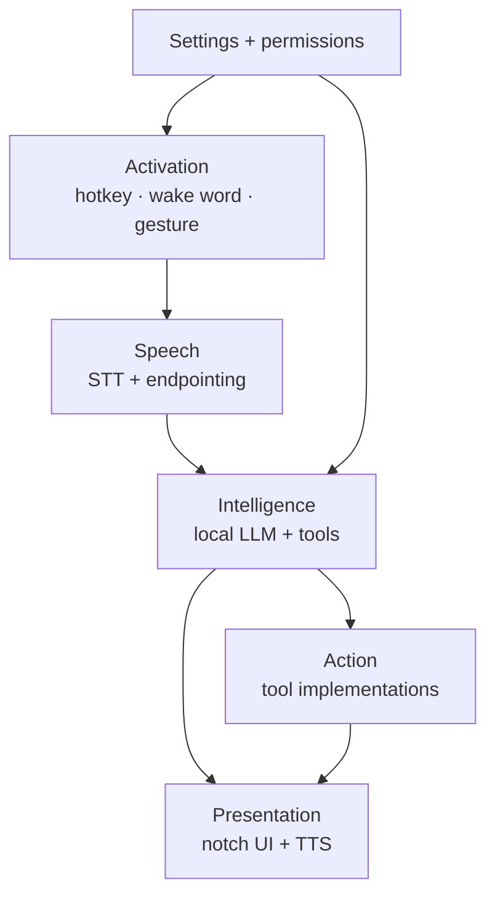
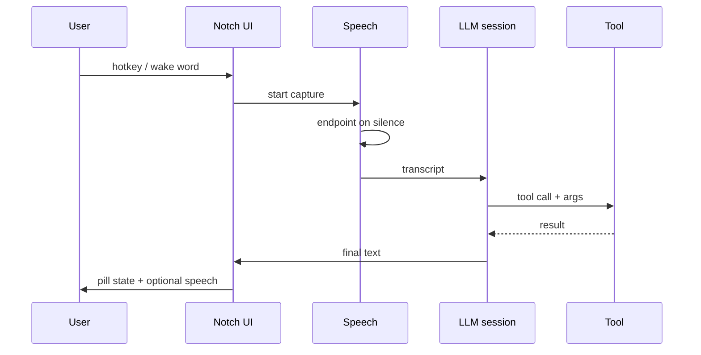
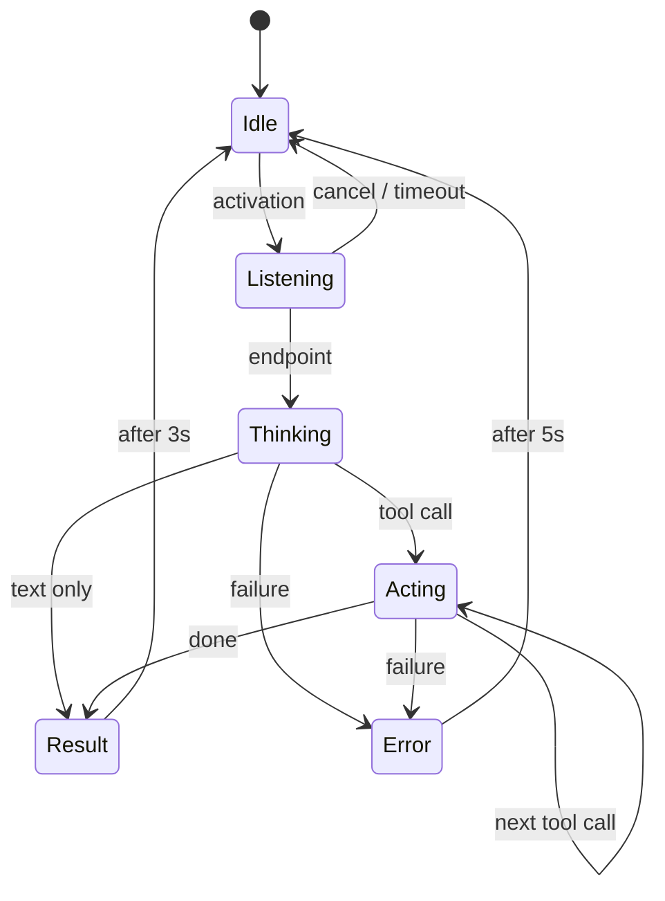
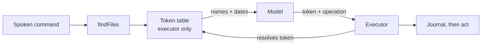

# Notch Assistant — Technical Specification

Sep 24, 2026 · @Batman

## Overview and goals

A background macOS app that lives in the MacBook's hardware notch, takes a spoken command, interprets it with a local language model, and executes it by driving other applications on the machine. The canonical test case used throughout this spec is: *"Open Arc and play the Mat Armstrong YouTube video."*

That example, and the tool catalog in §9, are **illustrative rather than exhaustive**. Spotify, browsing and file handling are the first capabilities, not the boundary of the product. The architecture's primary job is to make the *next* capability cheap to add, which is why every capability is a self-contained tool behind one protocol (§3) and why the registry is data-driven (§9).

### The offline premise, stated precisely

The requirement is **no cloud AI**, not *no network*. Inference is local: no API keys, no token cost, nothing leaves the machine. Actions are networked: Spotify, YouTube and web search inherently require internet. The app must degrade sensibly when offline — local tools keep working, network tools report unavailability rather than hanging.

### Goals

1. **Zero recurring cost.** Every dependency free or open source.
2. **Negligible idle footprint.** Invisible in Activity Monitor when not handling a command.
3. **Pinned to the built-in display.** Never rendered on an external monitor.
4. **Everything toggleable.** Disabling a capability removes it from the model's reach, not just from the UI.
5. **Fails visibly.** A misheard command, missing permission or failed tool call produces a legible state in the notch, never a silent no-op.
6. **Extensible by one file.** Adding a capability means writing one `AssistantTool` conformance and registering it. No changes to the coordinator, the UI, or the prompt. If adding a tool ever requires touching three layers, the abstraction is wrong.

### Non-goals for v1

- **No file contents, ever.** The agent can find, open and organise files. It cannot read what is inside one, and it cannot edit one. See §9.
- **No permanent deletion.** Removal means the Trash. The agent has no operation that destroys data, and cannot empty the Trash.
- **No general web agent.** In-page interaction is limited to a small set of scripted per-site recipes (§9).
- **No cross-session memory.** Context lasts one activation. No history, no retrieval, no personalisation store.
- **No text chat interface.** The notch is not a chat window.
- **No distribution.** Personally signed, one machine. No notarisation, no paid developer account.
- **No screen understanding.** No screenshots, no vision models over the display. The camera is used for hand pose only.
- **No arbitrary shell execution.** The model must never be given a `runCommand` tool. This is a hard security boundary, not a deferred feature.

## Target environment

| Item | Value | Consequence for design |
| --- | --- | --- |
| Machine | MacBook Air M4 | Fanless — sustained GPU load throttles rather than drains |
| OS floor | macOS 26 (Tahoe) | Foundation Models ships here; the MLX backend needs macOS 27 (§8) |
| Unified memory | 16 GB assumed | Budget ≤ 2 GB resident for the whole app including any model |
| Display | Built-in notched panel + occasional external monitor | UI pins to built-in only (§5) |
| Power | Mains almost always; battery is the exception | Two profiles, auto-switching (§11) |
| Language | Swift 6, SwiftUI | Strict concurrency on |

Because the machine is normally plugged in, always-on wake word and a resident model are acceptable. Two caveats survive that:

- **Thermals, not battery, are the real ceiling.** Back-to-back inference on a fanless chassis heat-soaks and slows down. Design for bursts, not sustained load.
- **Clamshell mode removes the notch entirely.** When the lid is closed the built-in display leaves `NSScreen.screens` and the UI has nowhere to render. This must be handled explicitly, not discovered as a crash (§5).

## System architecture

One process, five layers, each behind a protocol so it can be swapped or stubbed. No XPC, no helper daemons, no local HTTP server in v1.



Settings gates both activation and the tool set, which is why it points at two layers rather than sitting beside them.

### End-to-end flow for one command



### Layer contracts

| Layer | Protocol | Responsibility |
| --- | --- | --- |
| Activation | `ActivationSource` | Emits `.triggered` events; owns nothing else |
| Speech | `TranscriptionService` | Audio in, endpointed transcript out |
| Intelligence | `AssistantEngine` | Transcript in, tool calls and final text out |
| Action | `AssistantTool` | One capability, declared schema, async execute |
| Presentation | `NotchPresenter` | Renders state; never decides state |

A single `AssistantCoordinator` actor owns the state machine and is the only thing that talks across layers. Layers never call each other directly — this keeps the tool implementations testable without a microphone and the UI previewable without a model.

## Presentation layer

Built on [DynamicNotchKit](https://github.com/MrKai77/DynamicNotchKit) (MIT, Swift Package Manager). It draws the custom window, manages content insets and safe areas, and takes SwiftUI views directly. It also supports Macs without a notch via a floating window style, which doubles as the clamshell fallback (§5).

### App configuration

- `NSApp.setActivationPolicy(.accessory)` — no Dock icon, no app switcher entry.
- `MenuBarExtra` for the status item and settings entry point.
- Window level above the menu bar.
- `collectionBehavior`: `.canJoinAllSpaces`, `.stationary`, `.fullScreenAuxiliary` — so the pill stays put across Space switches and appears over full-screen apps.
- `ignoresMouseEvents` while idle, so the collapsed pill never steals clicks from the menu bar beneath it.

### UI state machine



### What each state shows

| State | Collapsed pill | Expanded |
| --- | --- | --- |
| Idle | Hidden, or a thin dot if enabled | — |
| Listening | Live audio-reactive bars | Partial transcript |
| Thinking | Indeterminate shimmer | Final transcript |
| Acting | Tool icon | Tool name and target |
| Result | Checkmark | One-line outcome |
| Error | Amber glyph | Reason and, if a permission is missing, a button to the right settings pane |

`Escape` cancels from any non-idle state and returns to Idle immediately, aborting in-flight tool calls.

## Display management

The requirement: the UI renders on the built-in notched display only, and survives monitors being plugged in, unplugged, rearranged or slept.

### Resolving the target screen

**Never use `NSScreen.main`.** It returns the screen with keyboard focus, so it follows the cursor to the external monitor — precisely the bug this section exists to prevent. Resolve the built-in screen explicitly:

1. Primary signal: `screen.safeAreaInsets.top > 0`. Only a notched display has a non-zero top inset. This is the more direct test because the notch, not merely the internal panel, is what the UI needs.
2. Fallback: read `NSScreenNumber` from `screen.deviceDescription` and test it with `CGDisplayIsBuiltin`.
3. If neither yields a screen, the built-in display is unavailable — go to the fallback policy below.

Expose this as a `DisplayResolver` with one published `targetScreen: NSScreen?`.

### Reacting to change

Observe `NSApplication.didChangeScreenParametersNotification`. It fires on connect, disconnect, resolution change, arrangement change and display sleep.

- **Debounce it.** The notification often fires several times in a burst while the system settles. 300 ms of quiet before acting.
- **Never cache the `NSScreen` object.** Those are invalidated across reconfigurations. Re-resolve from scratch every time; cache only the display ID if anything.
- **Reposition, don't recreate.** Tearing down and rebuilding the window on every notification causes visible flicker when a monitor wakes.

### Fallback policy when the built-in display is unavailable

A user-facing setting with three options:

| Option | Behaviour | Default |
| --- | --- | --- |
| Hide | UI disappears; hotkey and voice still work, feedback is spoken only | ✓ |
| Floating | DynamicNotchKit's floating style on the primary external display |  |
| Disable | Assistant suspends entirely until the lid reopens |  |

Clamshell is the common trigger for this, but display sleep and Sidecar can produce it too. Treat "no notched screen" as one condition with one handler rather than special-casing the lid.

## Activation layer

Three sources, each independently toggleable, all conforming to `ActivationSource` and feeding one arbitrated stream.

| Source | Mechanism | Idle cost | Default | Build phase |
| --- | --- | --- | --- | --- |
| Hotkey | `CGEvent` tap or `RegisterEventHotKey`, hold-to-talk | None | On | v0 |
| Wake word | openWakeWord (Apache-2.0) via ONNX Runtime | \~1–3% of one core | Off | v2 |
| Gesture | Vision `VNDetectHumanHandPoseRequest` | High — see below | Off | v4 |

### Hotkey

Hold-to-talk, not toggle: press and hold starts capture, release ends it. This removes the endpointing problem entirely for v0 and gives a reliable escape hatch when the wake word misbehaves. Default binding `⌥Space`, rebindable.

### Wake word

openWakeWord is Apache-2.0 and free, with pretrained models good enough for personal use. Custom wake-word quality depends on the training data you supply, and coverage is English-first. Picovoice Porcupine is more accurate out of the box but is proprietary and metered; its free tier is adequate for one machine, and it should sit behind the same `ActivationSource` protocol so it can be swapped in without touching anything else.

Run detection on a dedicated low-priority queue at 16 kHz mono. On detection, emit the trigger and hand the *already-buffered* preceding 500 ms to the speech layer so the first word of the command is not clipped.

### Gestures

Vision's hand-pose request over the front camera. This is the one genuinely expensive component in the design and the reason it is v4 and off by default:

- Continuous camera capture plus per-frame inference is a different order of cost from wake-word detection.
- The camera indicator light stays lit the entire time, which is intrusive on a machine used all day.

Mitigations, all required if the feature ships: cap capture at 10 fps, downscale frames before inference, require a two-frame confirmation before firing to suppress false positives, and auto-disable when on battery (§11). Start with two gestures only — open palm to activate, closed fist to cancel.

### Arbitration

The coordinator accepts a trigger only in the `Idle` state and applies a 1-second debounce across all sources. A trigger arriving in any other state is dropped, except a gesture-cancel, which is routed to the same path as `Escape`.

## Speech pipeline

### Speech to text

Primary: the system `Speech` framework with `requiresOnDeviceRecognition = true`. Free, no model download, Neural Engine accelerated, and it costs the least battery of any option. Partial results stream to the notch as the user talks, which makes the latency feel shorter than it is.

Fallback behind the same `TranscriptionService` protocol: `whisper.cpp` or `mlx-whisper` with a small or base model. Meaningfully better on accented speech and noisy rooms, at the cost of a model download and more energy per utterance. Make it a setting, not a rewrite.

### Endpointing

Hold-to-talk needs none — release ends the utterance. Wake word and gesture do:

- 800 ms of sub-threshold audio ends the utterance.
- 10 s hard cap regardless.
- 2 s of silence with no speech at all cancels back to Idle without invoking the model.

The silence threshold must adapt to the room's noise floor, sampled during the first 200 ms, or it will never fire with a fan or music playing.

### Text to speech

`AVSpeechSynthesizer` with a system voice. Free and built in. Speak only when the result is not self-evident — launching an app needs no narration, a failure or a spoken answer does. A "speak responses" setting with options Always / Errors only / Never, defaulting to Errors only.

### Audio session

- Duck other audio during capture rather than pausing it, so Spotify does not stop every time the wake word fires.
- Release the input device immediately after endpointing. Holding the microphone open keeps the orange indicator lit and looks like a bug.
- Handle device changes: switching to AirPods mid-session must not wedge the pipeline.

## Intelligence layer

### Primary backend: Foundation Models

macOS 26's [Foundation Models framework](https://developer.apple.com/videos/play/wwdc2025/286/) gives Swift-native access to the roughly 3-billion-parameter on-device model behind Apple Intelligence. It provides tool calling, structured output via `@Generable`, streaming and multi-turn sessions. Inference is free of cost and works offline. Per [Apple's model report](https://machinelearning.apple.com/research/apple-foundation-models-2025-updates), the developer implements a simple `Tool` Swift protocol and the framework handles the parallel and serial call graphs itself; the model was post-trained on tool-use data specifically to make this reliable.

This choice is what makes the project free, and on a fanless Air it is also the lightest option by a wide margin.

**Check availability at runtime.** Model availability varies by device and region, and Apple Intelligence must be enabled with its model downloaded. Handle the unavailable case with a legible message pointing at System Settings, not a crash.

### Designing for a 3B model

The single biggest determinant of quality. A 3B model is a competent intent parser and a poor free-form agent. Design accordingly:

- **Constrain, don't converse.** Use `@Generable` structured output so the model fills slots rather than reasoning in prose.
- **Keep the tool set small.** Only registered tools are visible to the model, and every tool you register enlarges the schema it must reason over. This is a second, concrete reason to gate capabilities at registration (§10) rather than in the UI.
- **Decompose compound commands explicitly.** *"Open Arc and play the Mat Armstrong video"* is two or three tool calls. Do not expect emergent planning — give the model a first-class `steps` array in the structured output and execute it in order.
- **Short instructions.** A long system prompt crowds the small context window. Keep it under roughly 200 tokens and push specifics into tool descriptions.
- **One activation, one session.** Create a fresh `LanguageModelSession` per command. No history carried across activations (§1 non-goals).

### Fallback backend: MLX

Confirmed against Apple's own sessions. At WWDC 2026 Apple opened the framework's model abstraction layer so nearly any language model can back a `LanguageModelSession`, through a new `LanguageModel` protocol. `SystemLanguageModel` and `PrivateCloudComputeLanguageModel` already conform, and Apple open-sourced two further implementations — `CoreAILanguageModel` and `MLXLanguageModel` — for running local models on the Neural Engine and the Mac's GPU ([session 241](https://developer.apple.com/videos/play/wwdc2026/241/)). Usage is a one-line swap: `MLXLanguageModel(modelID: "mlx-community/my-model")` in place of `SystemLanguageModel()`, session code unchanged ([session 339](https://developer.apple.com/videos/play/wwdc2026/339/)).

**Version requirement — this conflicts with §2.** These APIs ship in macOS 27, not macOS 26. The spec sets the floor at macOS 26 because that is where Foundation Models first shipped. Both statements are true, and the conflict needs deciding rather than papering over:

| Floor | Gain | Cost |
| --- | --- | --- |
| macOS 26 | Builds against what is installed today | No MLX fallback exists; the 3B model is the only backend |
| macOS 27 | The `LanguageModel` protocol, so the fallback is a genuine one-line swap | Requires upgrading the machine first |

**Recommendation:** keep the macOS 26 floor and build v0 to v2 against `SystemLanguageModel` alone. Write `AssistantEngine` against the Foundation Models API shape so the swap stays cheap later, but treat MLX as unavailable until the machine is on macOS 27. Do not design v1 around an API the target OS does not have.

Practical sizing on 16 GB: a 7B model at 4-bit quantisation occupies roughly 5.5 GB resident. That is affordable but not free, and on a fanless chassis it will throttle under repeated use. Treat MLX as the escape hatch for when the 3B model's intent parsing proves inadequate, not as the starting point. Ship the small model first and measure.

### Failure handling

| Failure | Response |
| --- | --- |
| Model unavailable | Error state, link to Apple Intelligence settings |
| No tool matched | Speak or show "I can't do that yet" — never guess a tool |
| Tool threw | Surface the tool's own message, keep remaining steps unexecuted |
| Context overflow | Truncate transcript, retry once, then fail visibly |
| Inference exceeded 10 s | Cancel, show timeout |

## Tool catalog

Every tool conforms to `AssistantTool`: a name, a description the model reads, a `@Generable` argument type, an async `execute`, and a `requiresNetwork` flag so the coordinator can pre-empt network tools when offline.

| Tool | Arguments | Network | Permission | Reversible | Phase |
| --- | --- | --- | --- | --- | --- |
| `openApp` | `appName` | No | None | n/a | v0 |
| `openURL` | `url`, `browser?` | Yes | None | n/a | v0 |
| `webSearch` | `query`, `engine?` | Yes | None | n/a | v1 |
| `findFiles` | `query`, `scope?`, `kind?` | No | Files | n/a — read-only, metadata only | v2 |
| `openFile` | `token`, `withApp?` | No | Files | n/a — hands off to another app | v2 |
| `controlSpotify` | `action`, `query?` | Yes | Automation | n/a | v2 |
| `systemControl` | `action`, `value?` | No | Varies | n/a | v2 |
| `organiseFiles` | `operation`, `tokens`, `destination?` | No | Files | **Required** | v3 |
| `playYouTube` | `query` | Yes | Accessibility | n/a | v3 |

This table will grow. Two columns are load-bearing for any tool added later: `Reversible`, which drives the undo journal (§9.6), and `Permission`, which generates the settings toggle and the permissions check automatically (§9.8).

Note what is absent and must stay absent: there is no `readFile`, no `editFile`, no `writeFile`, and no `deleteFile`.

### openApp

`NSWorkspace.shared.openApplication`. Resolve the spoken name against installed apps with fuzzy matching — the model will say "Arc" and the bundle is `Arc.app`, but it may also say "my browser". Maintain a small alias table in settings. If no confident match, fail rather than launching something arbitrary.

### openURL

`NSWorkspace.shared.open(_:configuration:)` with the target browser's bundle identifier when one is named, otherwise the system default.

Note on Arc specifically: The Browser Company shifted development focus to its successor, Dia, and Arc has been in maintenance. Do not hardcode Arc — read the preferred browser from settings, defaulting to the system default browser.

### webSearch

Construct a search URL and open it. Deliberately not an API call: no key, no cost, no rate limit. Engine configurable.

### controlSpotify

Drive the **desktop app via AppleScript**, not the Web API. AppleScript needs no OAuth flow, no registered application and no network round-trip, and transport control is instant. The user has Spotify Premium, so the Web API is also available and is optionally worth adding for one thing AppleScript does poorly: resolving a vague spoken request ("play that Mat Armstrong podcast") to a specific track or episode URI. Recommended split — AppleScript for transport and playback, Web API search purely as a resolver when a query is ambiguous, behind its own setting. The desktop app must be running for AppleScript; fall back to launching it.

Actions: `play`, `pause`, `next`, `previous`, `playTrack(query)`, `setVolume`. Requires the Automation permission for Spotify, requested on first use with a legible explanation.

### systemControl

Volume, brightness, Do Not Disturb, sleep, lock. Implemented with native APIs where available. **No shell escape hatch** — if a capability requires shelling out, it does not ship.

### playYouTube — the brittle one

This is the hardest tool in the spec and the most likely to break. Implement in two tiers:

**Tier 1 (reliable, ships first).** Open `youtube.com/results?search_query=...`. The user sees results and clicks. Fully deterministic, no permissions beyond opening a URL.

**Tier 2 (best-effort, opt-in).** Auto-click the first result using the Accessibility API (`AXUIElement`) to walk the browser's accessibility tree. Caveats the implementer must design around rather than discover:

- YouTube's accessibility tree is deep, inconsistent and changes without notice. Any selector will break eventually.
- The page must finish rendering first — poll for the element with a timeout, never sleep a fixed interval.
- Ads and shorts shelves frequently occupy the first result slot.
- Requires the Accessibility permission, which is the most intrusive grant the app asks for.

Write Tier 2 as a per-site recipe with a version-stamped selector strategy and an automatic fall back to Tier 1 on any failure. Never let a failed auto-click leave the user with nothing.

### File handling — the boundaries

Two absolute limits define this whole area. They are not settings, not defaults, and not toggles. They are architectural:

1. **The agent never reads file contents and never edits a file.** It operates on the file *as an object* — its name, location, kind and dates — and never on what is inside it. Opening a document hands it to another application; the agent does not see a single byte.
2. **The agent cannot permanently delete anything.** The only removal operation is moving to Trash. There is no unlink, no secure delete, and no ability to empty the Trash.

The design below exists to make these enforceable by structure rather than by instruction, because a rule written in a prompt is a request and a rule enforced by an API boundary is a guarantee.

### Consequences of the no-contents rule

This rule is more load-bearing than it first appears, and it simplifies the threat model enormously — the agent cannot leak a document because it never held one.

- **Search is metadata-only.** `NSMetadataQuery` is used with name, kind, and date predicates. Content-scope search (`kMDItemTextContent`) is explicitly **not** used, because it would return matched text from inside documents. Set the query's value list to metadata attributes only and never request content.
- **Results carry no previews, no thumbnails, no snippets.** The model receives names and dates, nothing more.
- **"Open my invoice"** resolves by filename, kind and recency. It cannot resolve by "the file that mentions Acme", and the notch should say so plainly rather than guessing, because the alternative is the agent silently doing something less private than the user expects.
- **Opening is a handoff.** `NSWorkspace.open` passes the file to Preview, Pages or whatever owns it. The agent's involvement ends at that call.

### Tokens: the model never handles a path

The single most important structural safeguard. `findFiles` returns results as opaque tokens — `file_a3f9`, `file_b210` — each carrying a display name, kind and modified date. Real paths stay in a session-scoped table inside the executor and are never serialised into the model's context.



Why this matters: the model has no vocabulary for expressing a path, so it cannot name a file that a search did not already find and validate. A mis-transcription yields a wrong *token* — a wrong file from a short candidate list, bounded and reversible. It can never yield a wrong *path*. This converts the catastrophic failure mode into a merely irritating one, and it is worth more than every other safeguard combined.

Tokens expire when the activation ends. A token from a previous command cannot be reused.

### Reversibility instead of confirmation

Confirmation dialogs are the mechanism that makes a feature annoying enough to abandon. If every rename needs approval, Finder wins and the agent goes unused. Reversibility buys the same safety without the friction.

Before any change, write its inverse to a journal on disk — on disk, not in memory, so it survives a crash. Only then act.

| Operation | Inverse | Notes |
| --- | --- | --- |
| Rename | Rename back | Extension preserved unless explicitly changed |
| Move | Move back | Same-volume only |
| Copy | Trash the copy |  |
| Trash | Restore from Trash | The only removal that exists |
| Create folder | Trash the folder | Only if still empty |

Operations with no clean inverse are **refused, not confirmed**: overwriting an existing file, moving across volumes, and touching an iCloud file not downloaded locally. If a destination name is taken, auto-suffix or decline — never overwrite. That one rule removes most genuinely unrecoverable outcomes.

### Validation belongs in the executor

Treat model output as untrusted input, exactly as you would a web form. Never rely on a prompt instruction like "don't touch system files". The executor independently checks, after resolving every token and canonicalising every path:

- Inside a user-configured scoped root (Documents, Downloads, Desktop by default).
- Not on the deny list: `~/Library`, `/System`, `/private`, anything inside a `.app` bundle, `.git` directories, dotfiles.
- Not a symlink pointing outside a scoped root.
- Destination does not already exist.
- Batch size at or under 20 items.

Any check failing means the operation is refused with a legible reason. No override exists.

### Resulting friction

| Operation | Behaviour |
| --- | --- |
| Search, open, reveal in Finder | Happens immediately |
| Rename or move one file | Happens immediately; notch shows the result and "say undo" for 5 seconds |
| Batch of 2–20 files | Shows the list, one confirmation |
| More than 20 files | Refused |
| Overwrite an existing file | Refused, auto-suffixed instead |
| Permanent deletion | Not implemented |
| Read or edit contents | Not implemented |

The common case has no dialog at all. Confirmation appears only where the blast radius genuinely exceeds one file.

**Accepted trade-off:** because the model can only act on tokens from a search in the same activation, "rename everything in Downloads" is not expressible in one step — it must search, then act on results. This is a real limitation and a deliberate one.

### Adding a tool later

The catalog above is a starting set. A new capability requires exactly four things, and nothing else:

1. A type conforming to `AssistantTool` with a `@Generable` argument struct.
2. A description string written for the model, not for a human — concrete, with an example phrasing.
3. An entry in `ToolRegistry` with its `requiresNetwork`, `reversibility` and required-permission metadata. `reversibility` is one of `notApplicable` (the tool changes nothing the user owns), `reversible` (the tool supplies an inverse for the journal), or `refused` (no inverse exists, so the operation is not offered). There is no separate destructive flag — a mutating tool that cannot supply an inverse does not ship.
4. A toggle in the Capabilities pane, generated automatically from that metadata rather than hand-written.

If step 4 requires editing the settings UI by hand, the registry is not data-driven enough — fix that rather than adding the toggle.

## Settings and permissions

A SwiftUI `Settings` scene reached from the `MenuBarExtra`, with `@AppStorage` backing every toggle. Seven panes.

### The gating principle

**Disabling a capability must remove its tool from the `LanguageModelSession`, not hide a button.** Two reasons, both load-bearing:

1. Security. The model cannot invoke what was never registered. A UI check is a suggestion; non-registration is a guarantee.
2. Accuracy. Every registered tool enlarges the schema the 3B model reasons over (§8). Fewer tools measurably improves selection on the ones that remain.

The tool registry therefore reads settings at session construction, every time.

### Panes

| Pane | Contents |
| --- | --- |
| Activation | Hotkey binding; wake word on/off, phrase, sensitivity; gestures on/off, which gestures, confirmation frames |
| Model | Backend (Foundation Models / MLX); model picker when MLX; response length; speak responses (Always / Errors only / Never) |
| Capabilities | One toggle per tool, generated from registry metadata; destructive tools flagged and grouped separately |
| Display | Fallback when no notched screen (Hide / Floating / Disable); show idle dot |
| Power | Auto-switch profiles on/off; what the battery profile disables |
| Permissions | Live status per grant, with deep links |
| Files | Scoped roots the file tools may touch; batch-confirmation threshold; journalled undo history; a fixed statement of the three things the agent cannot do |

### Permissions pane

Five separate grants, each of which will at some point be missing or revoked. Show live status for every one with a button that opens the exact settings pane:

| Permission | Needed for | Deep link |
| --- | --- | --- |
| Microphone | All voice input | `...?Privacy_Microphone` |
| Camera | Gestures only | `...?Privacy_Camera` |
| Accessibility | In-page navigation, global hotkey tap | `...?Privacy_Accessibility` |
| Automation | Spotify control | `...?Privacy_Automation` |
| Files and Folders | File search, open, rename, move (metadata only; never contents) | ...?Privacy\_FilesAndFolders |

Prefix: `x-apple.systempreferences:com.apple.preference.security`.

Also required in this pane: Apple Intelligence status, since the Foundation Models backend silently does nothing without it.

### Global controls

- **Kill switch** in the menu bar — suspends all activation sources immediately.
- **Activity indicator** showing whether the microphone or camera is currently live, independent of the system's own indicators. This is the difference between trusting the app and wondering about it.

## Power and thermal profiles

The machine is normally on mains, so the default profile is generous. The app must still behave when unplugged rather than assuming the happy path.

### Signals

- `ProcessInfo.processInfo.isLowPowerModeEnabled` — respect it unconditionally.
- `ProcessInfo.processInfo.thermalState` — `.serious` or `.critical` means back off.
- Power source via IOKit (`IOPSCopyPowerSourcesInfo`) for the plugged-in test.

Observe the notifications for the first two rather than polling.

### Profiles

| Feature | Plugged in | On battery | Thermal pressure |
| --- | --- | --- | --- |
| Hotkey | On | On | On |
| Wake word | On if enabled | Off | Off |
| Gestures | On if enabled | Off | Off |
| Backend | User's choice | Foundation Models forced | Foundation Models forced |
| Resident MLX model | Kept loaded | Unloaded after 5 min idle | Unloaded immediately |
| TTS | Per setting | Per setting | Per setting |

Auto-switching is itself a setting with an auto default, so the behaviour can be overridden rather than fought.

### Thermal specifics for a fanless chassis

The M4 Air has no fan, so sustained inference degrades throughput rather than draining the battery. Two consequences:

- Serialise inference. Never run two model calls concurrently, even if the architecture would permit it.
- On `.serious`, add a cooldown: refuse new activations for 30 seconds and say so in the notch rather than queueing them silently.

## Project setup

### Structure

```
NotchAssistant/
  App/              NotchAssistantApp.swift, AppDelegate, MenuBarExtra
  Coordinator/      AssistantCoordinator (actor), StateMachine
  Activation/       ActivationSource, Hotkey, WakeWord, Gesture
  Speech/           TranscriptionService, SystemSTT, WhisperSTT, Endpointer, Speaker
  Intelligence/     AssistantEngine, FoundationModelsEngine, MLXEngine, Prompt
  Tools/            AssistantTool, ToolRegistry, one file per tool
  Display/          DisplayResolver, NotchWindowController
  UI/               NotchView, state views, SettingsScene + panes
  Permissions/      PermissionChecker, deep links
  Power/            PowerProfileMonitor
  Support/          Logging, AppStorage keys
```

### Dependencies

| Package | Licence | Purpose | Phase |
| --- | --- | --- | --- |
| [DynamicNotchKit](https://github.com/MrKai77/DynamicNotchKit) | MIT | Notch window and UI | v1 |
| [openWakeWord](https://github.com/dscripka/openWakeWord) | Apache-2.0 | Wake word models | v2 |
| onnxruntime-swift | MIT | Runs the wake-word model | v2 |
| mlx-swift + mlx-swift-examples | MIT | Optional local model backend | Optional |

Everything else is a system framework: `FoundationModels`, `Speech`, `AVFoundation`, `Vision`, `AppKit`, `SwiftUI`, `IOKit`.

### Info.plist keys

`NSMicrophoneUsageDescription`, `NSCameraUsageDescription`, `NSSpeechRecognitionUsageDescription`, `NSDesktopFolderUsageDescription`, `NSDocumentsFolderUsageDescription`, `NSDownloadsFolderUsageDescription`, and `NSAppleEventsUsageDescription`. `LSUIElement` set to true.

`NSAppleEventsUsageDescription` is a single string covering all Apple Events the app sends, so it cannot name Spotify and the browser separately. Write one sentence that covers both honestly — macOS shows this text on the first Automation prompt, and the per-application grant is handled by the system, not by additional keys.

### Entitlements and signing

**Sandbox off.** Accessibility-tree traversal and AppleScript control of other apps are incompatible with the App Sandbox. This is acceptable because the app is not being distributed (§1 non-goals) but it is a deliberate decision, not an oversight.

Sign locally with a free personal Apple ID. A paid Developer Program membership is only needed to distribute, and is out of scope. No notarisation, no hardened runtime.

### Concurrency

Swift 6 strict concurrency. `AssistantCoordinator` is an actor; UI types are `@MainActor`; audio and inference run off the main thread. Tool `execute` methods are `async throws` and must honour cancellation, since `Escape` aborts in-flight work.

## Implementation phases

Build in this order. Each phase produces something usable on its own, and the riskiest work is deliberately last so the foundation is proven before it carries weight.

### v0 — Prove the loop

No notch UI at all. Hotkey → system STT → Foundation Models with two tools (`openApp`, `openURL`) → execute. Feedback via `NSAlert` or console.

**Done when:** holding `⌥Space` and saying "open Spotify" launches Spotify, and saying "open YouTube" opens it in the default browser.

### v1 — The notch

DynamicNotchKit integration, `DisplayResolver`, the full state machine, the settings scene with the Capabilities and Permissions panes. Add `webSearch`.

**Done when:** the pill shows all six states correctly, and plugging in an external monitor leaves it on the built-in display.

### v2 — Always listening

Wake word, endpointing, power profiles, file search and open, `controlSpotify`, `systemControl`. TTS.

**Done when:** the wake phrase reliably activates across a day of normal use with fewer than two false positives, "play some music" starts Spotify playback, and "open my invoice from last month" finds and opens the right file.

### v3 — In-page

`playYouTube` Tier 1, then Tier 2 behind a setting. File management with the full scoping, confirmation and undo flow. Accessibility permission flow.

**Done when:** renaming a single file by voice completes immediately with no dialog and reverses on "undo that"; a batch of five shows one confirmation listing the files; and the canonical YouTube command reaches search results every time, the video itself most of the time, and a dead end never.

### v4 — Gestures

Vision hand pose, two gestures, all the mitigations in §6.

**Done when:** gestures work at arm's length in normal room lighting, and enabling them does not make the machine warm at idle.

### Sequencing rationale


In-page navigation and gestures are the two highest-effort, lowest-reliability components. Everything else should be solid before either is attempted, so that when they misbehave it is obvious they are the cause.

## Testing

### Automated

The protocol boundaries in §3 exist so that most of the app is testable without hardware.

- **Tools.** Each `AssistantTool` tested directly with fixture arguments. `openApp` fuzzy matching gets a table of spoken names and expected bundle IDs, including the ones that should fail.
- **State machine.** Every transition in §4, including cancellation from each non-idle state.
- **DisplayResolver.** Injected fake screen lists: built-in only, built-in plus external, external only, empty. The last case is the clamshell path and must not crash.
- **Intent parsing.** A fixture corpus of roughly 50 transcripts mapped to expected tool-call sequences, run against the real Foundation Models backend. This is the regression suite that matters most — it is what tells you whether a prompt change helped.
- **Endpointer.** Recorded audio fixtures at several noise floors.

### Manual checklist

Things no test will catch:

- [ ] Plug in an external monitor mid-command — the pill stays on the built-in display
- [ ] Close the lid while docked — fallback policy applies, no crash, no orphaned window
- [ ] Switch Spaces and enter a full-screen app — the pill still appears
- [ ] Revoke Accessibility in System Settings while running — error state is legible and links correctly
- [ ] Disconnect Wi-Fi — local tools still work, network tools fail with a clear message
- [ ] Disable Apple Intelligence — the app explains itself rather than going silent
- [ ] Run the wake word for a full working day — count false positives
- [ ] Issue ten commands back to back — check thermal state and whether responses slow
- [ ] Click the menu bar where the collapsed pill sits — the click reaches the menu bar
- [ ] Ask the agent what is inside a document — it declines rather than attempting it
- [ ] Ask it to delete a file permanently — it trashes instead and says so
- [ ] Rename a file, then say "undo that" — original name restored
- [ ] Rename to a name already in use — refused or auto-suffixed, never overwritten
- [ ] Kill the app mid-operation, relaunch — the journal is intact and undo still works

### Acceptance

The project is done when the canonical command works end to end from a cold idle state, and when a week of daily use produces no crash, no stuck microphone indicator, and no rendering on the external monitor.

## Risks and open decisions

### Ranked risks

| Risk | Likelihood | Mitigation |
| --- | --- | --- |
| In-page auto-click breaks on a YouTube change | High | Tier 1 always available as fallback; treat Tier 2 as disposable |
| 3B model mis-parses compound commands | Medium-high | Structured output with an explicit `steps` array; MLX escape hatch |
| Wake-word false positives make it unusable | Medium | Sensitivity setting; hotkey always available; consider Porcupine free tier |
| Accessibility permission friction | Medium | Permissions pane with live status and deep links |
| Thermal throttling under repeated use | Medium | Serialise inference; cooldown on `.serious` |
| Sandbox-off means no future distribution | Low impact | Accepted; out of scope |
| Mis-transcribed filename causes a wrong-file operation | Medium | Token indirection bounds it to search results; journalled undo; trash not delete; nothing is unrecoverable |
| Tool count grows and dilutes model accuracy | Medium | Capability toggles keep the registered set small; re-run the intent corpus after each new tool |

### Open decisions for the implementer

These are genuine forks. Flag them rather than guessing:

1. **Wake-word engine.** openWakeWord is free and Apache-2.0 but needs training data for a custom phrase; Porcupine is more accurate out of the box, proprietary, and free only at small scale. Start with openWakeWord behind the protocol and switch if false positives prove intolerable.
2. **STT engine.** System `Speech` is free and lightest; Whisper is more accurate on accented speech. Build both, default to system, let real use decide.
3. **Collapsed idle appearance.** Fully hidden or a thin persistent dot. Affects whether the app feels present or intrusive. Make it a setting; pick a default after living with it.
4. **Gesture vocabulary.** Two gestures is the recommendation. More increases false positives faster than it increases usefulness.

### Things that must not drift

These are the invariants. If a future change violates one, the change is wrong, not the rule.

- No `runCommand` tool, ever (§1).
- No tool reads file contents. No tool edits a file. No `readFile`, `editFile` or `writeFile` exists (§9).
- File search is metadata-only. Content-scope Spotlight predicates are never used (§9).
- No permanent deletion. Trash is the only removal, and the Trash cannot be emptied by the agent (§9).
- The model receives tokens, never paths, and can only act on tokens from a search in the same activation (§9).
- Every mutating operation journals its inverse to disk before acting; operations with no clean inverse are refused (§9).
- Existing files are never overwritten — auto-suffix or decline (§9).
- Path validation lives in the executor after canonicalisation, never in the prompt (§9).
- Capability toggles gate tool *registration*, not UI visibility (§10).
- `NSScreen.main` is never used to place the window (§5).
- Tier 2 in-page navigation always falls back to Tier 1 (§9).

## Sources

- [Foundation Models framework — WWDC25](https://developer.apple.com/videos/play/wwdc2025/286/)
- [Apple on-device and server foundation models](https://machinelearning.apple.com/research/apple-foundation-models-2025-updates)
- [DynamicNotchKit](https://github.com/MrKai77/DynamicNotchKit)
- [openWakeWord](https://github.com/dscripka/openWakeWord)
- [Apple MLX in 2026: developer guide](https://www.digitalapplied.com/blog/apple-mlx-framework-local-ai-developers-2026-guide)
- [What's new in the Foundation Models framework — WWDC26 session 241](https://developer.apple.com/videos/play/wwdc2026/241/)
- [Bring an LLM provider to the Foundation Models framework — WWDC26 session 339](https://developer.apple.com/videos/play/wwdc2026/339/)
