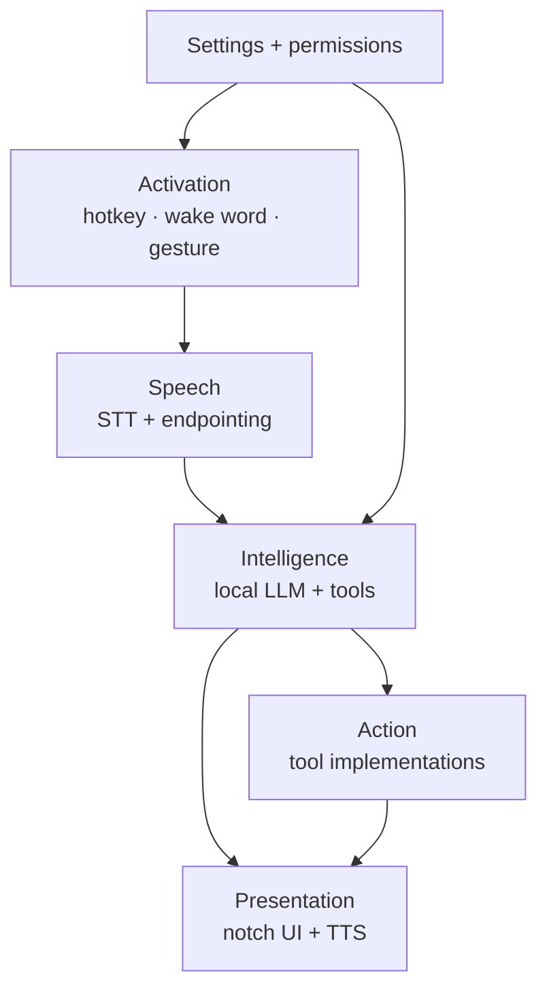
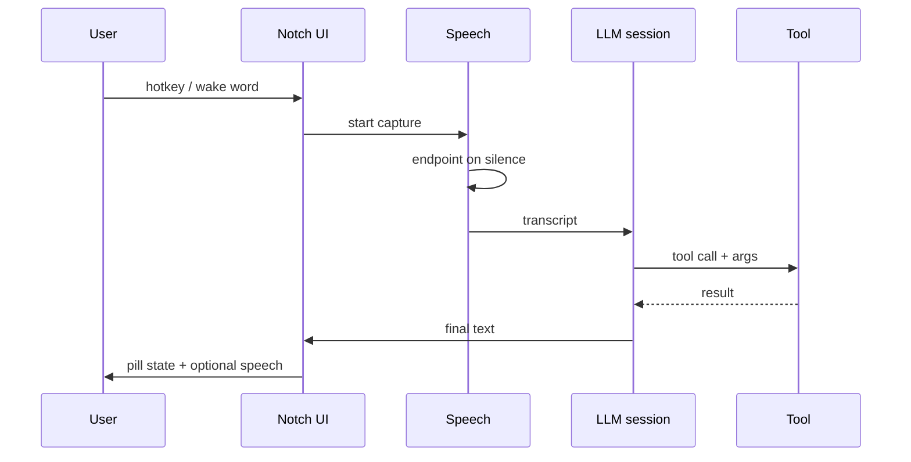
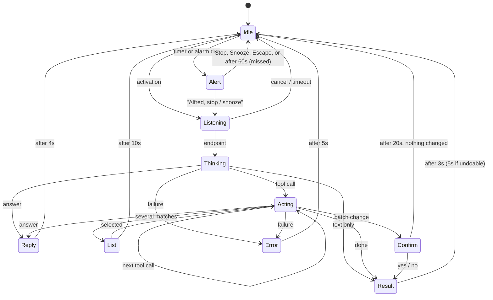
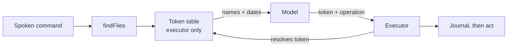

# Notch Assistant — Technical Specification

Sep 24, 2026 · @Batman · updated Sep 26, 2026 to match the build

> **Status.** v0–v4 are built. Beyond the original plan, it also has weather, routines, the clock (timers, alarms, stopwatch, reminders), the calendar, desktop tools (windows, clipboard, notes) and a natural voice (Kokoro). Gestures (v4) are built but untested with a real camera at the time of writing. Where the build departs from the original design, the section says so, and §1.4 lists every departure in one place. The assistant is called **Alfred**, after its wake word.

## Overview and goals

A background macOS app that lives in the MacBook's hardware notch, takes a spoken command, interprets it with a local language model, and executes it by driving other applications on the machine. The canonical test case used throughout this spec is: *"Open Arc and play the Mat Armstrong YouTube video."*

That example, and the tool catalog in §9, are **illustrative rather than exhaustive**. Spotify, browsing and file handling are the first capabilities, not the boundary of the product. The architecture's primary job is to make the *next* capability cheap to add, which is why every capability is a self-contained tool behind one protocol (§3) and why the registry is data-driven (§9).

### The offline premise, stated precisely

The requirement is **no cloud AI**, not *no network*. Inference is local: no API keys, no token cost, nothing leaves the machine. Actions are networked: Spotify, YouTube and web search inherently require internet. The app must degrade sensibly when offline — local tools keep working, network tools report unavailability rather than hanging.

### Goals

1. **Zero recurring cost.** Every dependency free or open source.
2. **Negligible idle footprint.** Invisible in Activity Monitor when not handling a command.
3. **Pinned to the built-in display.** Never rendered on an external monitor.
4. **Everything toggleable.** Disabling a capability removes it from the model's reach, not just from the UI.
5. **Fails visibly.** A misheard command, missing permission or failed tool call produces a legible state in the notch, never a silent no-op.
6. **Extensible by one file.** Adding a capability means writing one `AssistantTool` conformance and registering it. No changes to the coordinator, the UI, or the prompt. If adding a tool ever requires touching three layers, the abstraction is wrong.

### Non-goals for v1

- **No editing file contents, ever.** The agent can find, open, organise and (since 28 Sep 2026) *read* files within allowed folders, on the Mac. It can never change what is inside one. See §9 and "readFile".
- **No permanent deletion.** Removal means the Trash. The agent has no operation that destroys data, and cannot empty the Trash.
- **No general web agent.** In-page interaction is limited to a small set of scripted per-site recipes (§9).
- **No cross-session memory** (v1). Context lasts one activation. *Revised 27 Sep 2026:* opt-in, local conversation memory is planned (see "Next: agreed on 27 Sep 2026" under Implementation phases).
- **No text chat interface.** The notch is not a chat window.
- **No distribution (for now).** One machine, signed with the owner's Apple Developer account (needed for the WeatherKit entitlement, §9). Publishing later means a Developer ID build with notarisation; the Mac App Store is out, because the app cannot run sandboxed (§13).
- **No ambient screen understanding.** *Revised 28 Sep 2026:* the screen is read only when asked ("what does this error say"), never on a schedule, and nothing read is stored. The camera is used for hand pose only.
- **No arbitrary shell execution.** The model must never be given a `runCommand` tool. This is a hard security boundary, not a deferred feature.

### Departures from the original design

| Area | Original plan | As built | Why |
| --- | --- | --- | --- |
| Wake word | openWakeWord ONNX model | Apple's `SpeechAnalyzer` listening for "Alfred"; openWakeWord kept as a second engine | The community model scored the owner's voice at 0.001, and training a custom model failed repeatedly. The system recognizer hears "Alfred" reliably, with any prefix. |
| Notch UI | DynamicNotchKit as a package | Vendored copy with patches (`Vendor/DynamicNotchKit/PATCHES.md`) | Hover behaviour kept the notch open and crashed on hover; fixed in the copy |
| Intent parsing | Model for every command | Routines, then small talk, then `DirectMatcher` (fixed phrasings), then the model | The 3B model was not deterministic enough for simple commands (§8) |
| Model context | Every enabled tool shown | `ToolRouter` shows at most 4 tools, picked by keyword | All tools overflowed the 4,096-token context |
| Argument trust | Executor validation for files | Also *grounding*: a tool refuses an argument the user never said | The model invented URLs, apps, browsers and songs |
| UI states | Six | Ten: adds Reply (spoken answer), List (pick one), Confirm (yes/no) and Alert (a timer or alarm ringing) | Weather answers, same-named files, batch changes, timers |
| Spotify | AppleScript; Web API optional | Both: AppleScript for playback, Web API (user's own client ID, loopback OAuth) to resolve songs and playlists | Spoken names rarely match exactly |
| systemControl | Native APIs only | Volume and mute through CoreAudio; brightness and lock by simulated keys (Accessibility); Do Not Disturb through the user's shortcut | macOS has no public API for brightness or Focus. Still no shell. |
| File search | `NSMetadataQuery` | `MDQuery` on a background thread | `NSMetadataQuery` spun a nested run loop and stalled the main thread |
| Signing | Free personal team | Apple Development certificate plus a provisioning profile | WeatherKit needs an entitlement from a profile |
| New capabilities | — | `getWeather`, `runShortcut`, routines, file undo, clock tools | Requested during use |

## Target environment

| Item | Value | Consequence for design |
| --- | --- | --- |
| Machine | MacBook Air M4 | Fanless — sustained GPU load throttles rather than drains |
| OS floor | macOS 26 (Tahoe) | Foundation Models ships here; the MLX backend needs macOS 27 (§8) |
| Unified memory | 16 GB assumed | Budget ≤ 2 GB resident for the whole app including any model |
| Display | Built-in notched panel + occasional external monitor | UI pins to built-in only (§5) |
| Power | Mains almost always; battery is the exception | Two profiles, auto-switching (§11) |
| Language | Swift 6, SwiftUI | Strict concurrency on |

Because the machine is normally plugged in, always-on wake word and a resident model are acceptable. Two caveats survive that:

- **Thermals, not battery, are the real ceiling.** Back-to-back inference on a fanless chassis heat-soaks and slows down. Design for bursts, not sustained load.
- **Clamshell mode removes the notch entirely.** When the lid is closed the built-in display leaves `NSScreen.screens` and the UI has nowhere to render. This must be handled explicitly, not discovered as a crash (§5).

## System architecture

One process, five layers, each behind a protocol so it can be swapped or stubbed. No XPC, no helper daemons, no local HTTP server in v1.



Settings gates both activation and the tool set, which is why it points at two layers rather than sitting beside them.

### End-to-end flow for one command



### Layer contracts

| Layer | Protocol | Responsibility |
| --- | --- | --- |
| Activation | `ActivationSource` | Emits `.triggered` events; owns nothing else |
| Speech | `TranscriptionService` | Audio in, endpointed transcript out |
| Intelligence | `AssistantEngine` | Transcript in, a `Plan` out: steps (tool + arguments), a reply, or a routine |
| Action | `AssistantTool` | One capability, declared schema, async execute |
| Presentation | `NotchPresenter` | Renders state; never decides state |

A single `AssistantCoordinator` actor owns the state machine and is the only thing that talks across layers. Layers never call each other directly — this keeps the tool implementations testable without a microphone and the UI previewable without a model.

## Presentation layer

Built on [DynamicNotchKit](https://github.com/MrKai77/DynamicNotchKit) (MIT). It draws the custom window, manages content insets and safe areas, and takes SwiftUI views directly. It also supports Macs without a notch via a floating window style, which doubles as the clamshell fallback (§5).

**As built:** a patched copy lives in `Vendor/DynamicNotchKit`, with every change listed in `PATCHES.md`. `NotchController` feeds show and hide requests through one serial queue so transitions never overlap, and the notch no longer stays open while hovered. Never use `MainActor.assumeIsolated` in callbacks from AppKit or Carbon; hop with `Task { @MainActor in … }`. The assumption crashed the app twice.

### App configuration

- `NSApp.setActivationPolicy(.accessory)` — no Dock icon, no app switcher entry.
- `MenuBarExtra` for the status item and settings entry point.
- Window level above the menu bar.
- `collectionBehavior`: `.canJoinAllSpaces`, `.stationary`, `.fullScreenAuxiliary` — so the pill stays put across Space switches and appears over full-screen apps.
- `ignoresMouseEvents` while idle, so the collapsed pill never steals clicks from the menu bar beneath it.

### UI state machine



### What each state shows

| State | Collapsed pill | Expanded |
| --- | --- | --- |
| Idle | Hidden, or a thin dot if enabled | — |
| Listening | Live audio-reactive bars | Partial transcript |
| Thinking | Indeterminate shimmer | Final transcript |
| Acting | Tool icon | Tool name and target |
| Result | Checkmark | One-line outcome; "say undo" when undoable |
| Reply | Speech glyph | A spoken answer (weather, small talk, a routine's closing line) |
| List | Count | Up to ten files to click; a single match opens directly |
| Confirm | Question glyph | The files a batch will change; answer by voice ("yes" / "no") or click |
| Alert | Wiggling timer or alarm glyph | What rang, with Stop (and Snooze for alarms); a chime repeats until stopped |
| Error | Amber glyph | Reason and, if a permission is missing, a button to the right settings pane |

`Escape` cancels from any non-idle state and returns to Idle immediately, aborting in-flight tool calls.

## Display management

The requirement: the UI renders on the built-in notched display only, and survives monitors being plugged in, unplugged, rearranged or slept.

### Resolving the target screen

**Never use `NSScreen.main`.** It returns the screen with keyboard focus, so it follows the cursor to the external monitor — precisely the bug this section exists to prevent. Resolve the built-in screen explicitly:

1. Primary signal: `screen.safeAreaInsets.top > 0`. Only a notched display has a non-zero top inset. This is the more direct test because the notch, not merely the internal panel, is what the UI needs.
2. Fallback: read `NSScreenNumber` from `screen.deviceDescription` and test it with `CGDisplayIsBuiltin`.
3. If neither yields a screen, the built-in display is unavailable — go to the fallback policy below.

Expose this as a `DisplayResolver` with one published `targetScreen: NSScreen?`.

### Reacting to change

Observe `NSApplication.didChangeScreenParametersNotification`. It fires on connect, disconnect, resolution change, arrangement change and display sleep.

- **Debounce it.** The notification often fires several times in a burst while the system settles. 300 ms of quiet before acting.
- **Never cache the `NSScreen` object.** Those are invalidated across reconfigurations. Re-resolve from scratch every time; cache only the display ID if anything.
- **Reposition, don't recreate.** Tearing down and rebuilding the window on every notification causes visible flicker when a monitor wakes.

### Fallback policy when the built-in display is unavailable

A user-facing setting with three options:

| Option | Behaviour | Default |
| --- | --- | --- |
| Hide | UI disappears; hotkey and voice still work, feedback is spoken only | ✓ |
| Floating | DynamicNotchKit's floating style on the primary external display |  |
| Disable | Assistant suspends entirely until the lid reopens |  |

Clamshell is the common trigger for this, but display sleep and Sidecar can produce it too. Treat "no notched screen" as one condition with one handler rather than special-casing the lid.

## Activation layer

Three sources, each independently toggleable, all conforming to `ActivationSource` and feeding one arbitrated stream.

| Source | Mechanism | Idle cost | Default | Build phase |
| --- | --- | --- | --- | --- |
| Hotkey | `CGEvent` tap or `RegisterEventHotKey`, hold-to-talk | None | On | v0 |
| Wake word | `SpeechAnalyzer` listening for "Alfred" (openWakeWord as an alternative engine) | Low; Neural Engine | Off | v2 |
| Gesture | Vision `VNDetectHumanHandPoseRequest` | High — see below | Off | v4 |

### Hotkey

Hold-to-talk, not toggle: press and hold starts capture, release ends it. This removes the endpointing problem entirely for v0 and gives a reliable escape hatch when the wake word misbehaves. Default binding `⌥Space`, rebindable.

### Wake word

openWakeWord is Apache-2.0 and free, with pretrained models good enough for personal use. Custom wake-word quality depends on the training data you supply, and coverage is English-first. Picovoice Porcupine is more accurate out of the box but is proprietary and metered; its free tier is adequate for one machine, and it should sit behind the same `ActivationSource` protocol so it can be swapped in without touching anything else.

Run detection on a dedicated low-priority queue at 16 kHz mono. On detection, emit the trigger and hand the *already-buffered* preceding 500 ms to the speech layer so the first word of the command is not clipped.

**As built.** openWakeWord's community model did not recognise the owner's voice, and training a custom "hey Alfred" model failed in Colab. The default engine is now Apple's on-device `SpeechAnalyzer`/`SpeechTranscriber`, primed with "Alfred" as a contextual string and read from its fast, volatile results. It accepts any prefix ("hey", "okay", "good morning") and a command in the same breath ("Alfred, open Notes"). Details:

- 2.5 s of pre-roll goes to the command recognizer, since the command often ends before detection fires.
- Detections are de-duplicated by audio time, because the volatile and final results both report the same word.
- A detection from this engine is already confirmed, so the second-stage check is skipped; common mishearings of the wake word are stripped from the command.
- The openWakeWord path (`WakeWordDetector`, ONNX Runtime) remains selectable in Settings.

### Gestures

Vision's hand-pose request over the front camera. This is the one genuinely expensive component in the design and the reason it is v4 and off by default:

- Continuous camera capture plus per-frame inference is a different order of cost from wake-word detection.
- The camera indicator light stays lit the entire time, which is intrusive on a machine used all day.

Mitigations, all required if the feature ships: cap capture at 10 fps, downscale frames before inference, require a two-frame confirmation before firing to suppress false positives, and auto-disable when on battery (§11). Start with two gestures only — open palm to activate, closed fist to cancel.

**As built (`GestureListener`):**

- **Capture:** the front camera at 640×480; frames past 10 per second are dropped before Vision sees them.
- **Detection:** `VNDetectHumanHandPoseRequest` finds at most one hand, keeping joints with confidence > 0.5.
- **Classification** (`HandJoints`, from the four fingers, ignoring the thumb):
  - *open palm* when every fingertip is well beyond both its middle joint and its knuckle, measured from the wrist;
  - *fist* when every fingertip is nearer the wrist than its middle joint.
- **Confirmation:** stricter than the two frames above. A gesture must be held for 5 consecutive frames (half a second), then there is a 3 s cooldown (`GestureDebouncer`).
- **What each does:**
  - An open palm starts a hands-free session like the wake word, but with no pre-roll, and the endpointer measures the room itself.
  - A fist is the same as Escape.
- **Off by default.** It is also paused, like the wake word, on battery, when hot, with the kill switch, or with no built-in display.
- **Privacy:** nothing is recorded or stored.

### Arbitration

The coordinator accepts a trigger only in the `Idle` state and applies a 1-second debounce across all sources. A trigger arriving in any other state is dropped, except a gesture-cancel, which is routed to the same path as `Escape`.

## Speech pipeline

### Speech to text

Primary: the system `Speech` framework with `requiresOnDeviceRecognition = true`. Free, no model download, Neural Engine accelerated, and it costs the least battery of any option. Partial results stream to the notch as the user talks, which makes the latency feel shorter than it is.

Fallback behind the same `TranscriptionService` protocol: `whisper.cpp` or `mlx-whisper` with a small or base model. Meaningfully better on accented speech and noisy rooms, at the cost of a model download and more energy per utterance. Make it a setting, not a rewrite.

### Endpointing

Hold-to-talk needs none — release ends the utterance. Wake word and gesture do:

- 800 ms of sub-threshold audio ends the utterance.
- 10 s hard cap regardless.
- 2 s of silence with no speech at all ends listening. The command may still be in the pre-roll, so it is transcribed. An empty transcript, or one that is only the wake word, returns to Idle without invoking the model.

The silence threshold must adapt to the room's noise floor, sampled during the first 200 ms, or it will never fire with a fan or music playing.

### Text to speech

`AVSpeechSynthesizer` with a system voice. Free and built in. Speak only when the result is not self-evident — launching an app needs no narration, a failure or a spoken answer does. A "speak responses" setting with options Always / Errors only / Never, defaulting to Errors only. Answers (weather, routines' closing lines) are always spoken unless set to Never.

**As built:** Settings lists installed voices, best quality first. Premium voices (downloaded in System Settings → Accessibility → Spoken Content) sound far less robotic than the enhanced ones.

**Natural voice (Kokoro).** Kokoro-82M (Apache-2.0) is available as a set of natural voices (British and American, e.g. "George — British"). It runs on the Neural Engine through FluidAudio's Core ML port.

- **Download:** the model (about 80 MB) comes from Hugging Face the first time a Kokoro voice is chosen, into Application Support/NotchAssistant/Kokoro. After that it works offline.
- **Speed:** measured on the M4 Air, loading from disk takes 0.15 s. The first sentence takes about 0.7 s and later ones about 0.2 s for several seconds of speech.
- **Memory:** it holds about 500 MB while loaded. So it loads while the user is speaking (to hide the delay) and unloads after 3 idle minutes; the idle footprint doesn't change.
- **Fallback:** if Kokoro isn't downloaded or fails, the system voice speaks instead.
- **Structure:** `Speaker` (Core) knows it only through the `NeuralVoice` protocol, so Core and its tests don't depend on FluidAudio.
- **Dependency:** FluidAudio is added with no package traits, which leaves out its prebuilt text-normalisation binary (used only by non-English voices).

### Audio session

- Duck other audio during capture rather than pausing it, so Spotify does not stop every time the wake word fires. **As built:** `AudioDucker` lowers the Mac's output volume while listening and restores it afterwards (the original level is saved first, so a crash can't leave it low) (a setting, on by default); without it the recognizer could not hear over music.
- Release the input device immediately after endpointing. Holding the microphone open keeps the orange indicator lit and looks like a bug.
- Handle device changes: switching to AirPods mid-session must not wedge the pipeline.

## Intelligence layer

### Model layer (as built, 28 Sep 2026)

Every model call goes through `ModelRouter.backend(for: ModelTask)`, with tasks `intent`, `conversation`, `summarize` and `analysis`. The only backend today is `AppleFoundationBackend`: the only code that creates a `LanguageModelSession`, with a 4,096-token context. Framework errors become `ModelError`.

- **Structured output** is still described with `@Generable` types and `GenerationSchema`. Every tool declares its arguments that way, and a future backend translates from them.
- **The four call sites:** command planning, conversation, meeting summaries and conversation memory, plus document reading. Their prompts were moved unchanged.
- **The seam:** a larger local model (MLX) would take `summarize` and `analysis` here.

### Primary backend: Foundation Models

macOS 26's [Foundation Models framework](https://developer.apple.com/videos/play/wwdc2025/286/) gives Swift-native access to the roughly 3-billion-parameter on-device model behind Apple Intelligence. It provides tool calling, structured output via `@Generable`, streaming and multi-turn sessions. Inference is free of cost and works offline. Per [Apple's model report](https://machinelearning.apple.com/research/apple-foundation-models-2025-updates), the developer implements a simple `Tool` Swift protocol and the framework handles the parallel and serial call graphs itself; the model was post-trained on tool-use data specifically to make this reliable.

This choice is what makes the project free, and on a fanless Air it is also the lightest option by a wide margin.

**Check availability at runtime.** Model availability varies by device and region, and Apple Intelligence must be enabled with its model downloaded. Handle the unavailable case with a legible message pointing at System Settings, not a crash.

### Designing for a 3B model

The single biggest determinant of quality. A 3B model is a competent intent parser and a poor free-form agent. Design accordingly:

- **Constrain, don't converse.** Use `@Generable` structured output so the model fills slots rather than reasoning in prose.
- **Keep the tool set small.** Only registered tools are visible to the model, and every tool you register enlarges the schema it must reason over. This is a second, concrete reason to gate capabilities at registration (§10) rather than in the UI.
- **Decompose compound commands explicitly.** *"Open Arc and play the Mat Armstrong video"* is two or three tool calls. Do not expect emergent planning — give the model a first-class `steps` array in the structured output and execute it in order.
- **Short instructions.** A long system prompt crowds the small context window. Keep it under roughly 200 tokens and push specifics into tool descriptions.
- **One activation, one session.** Create a fresh `LanguageModelSession` per command. No history carried across activations (§1 non-goals).

### The planning pipeline, as built

Most commands never reach the model. Each stage returns a plan or passes the command on:

1. **Clean.** Strip punctuation and filler ("Open YouTube." → "open youtube").
2. **Routines** (§9). A user-defined phrase runs its steps as written.
3. **Small talk and refusals.** "Thanks", "who are you", and requests for file contents get fixed replies.
4. **`DirectMatcher`.** Each tool can claim fixed phrasings ("open X", "play X on Spotify", "how's the weather in Paris", "turn on DND"). A command with "and" or "then" is left to the model, since it has several steps.
5. **`ToolRouter`, then the model.** The model sees at most 4 tools, chosen by keyword, in a structured-output schema whose steps are each one of those tools (`DynamicGenerationSchema`). With every tool the prompt reached 5,070 tokens and overflowed the 4,096-token context. The worst case with the router is about 2,560 tokens.

**Grounding.** The model's output is untrusted (see §9, validation). On top of the executor's checks, each tool refuses arguments the user did not say: a URL, app, browser, song, place or file name must appear in the transcript. `CommandContext` carries the transcript to the tool as a task-local value. Routine steps have no transcript, and so skip this check, because the user wrote them.

### Fallback backend: MLX

Confirmed against Apple's own sessions. At WWDC 2026 Apple opened the framework's model abstraction layer so nearly any language model can back a `LanguageModelSession`, through a new `LanguageModel` protocol. `SystemLanguageModel` and `PrivateCloudComputeLanguageModel` already conform, and Apple open-sourced two further implementations — `CoreAILanguageModel` and `MLXLanguageModel` — for running local models on the Neural Engine and the Mac's GPU ([session 241](https://developer.apple.com/videos/play/wwdc2026/241/)). Usage is a one-line swap: `MLXLanguageModel(modelID: "mlx-community/my-model")` in place of `SystemLanguageModel()`, session code unchanged ([session 339](https://developer.apple.com/videos/play/wwdc2026/339/)).

**Version requirement — this conflicts with §2.** These APIs ship in macOS 27, not macOS 26. The spec sets the floor at macOS 26 because that is where Foundation Models first shipped. Both statements are true, and the conflict needs deciding rather than papering over:

| Floor | Gain | Cost |
| --- | --- | --- |
| macOS 26 | Builds against what is installed today | No MLX fallback exists; the 3B model is the only backend |
| macOS 27 | The `LanguageModel` protocol, so the fallback is a genuine one-line swap | Requires upgrading the machine first |

**Recommendation:** keep the macOS 26 floor and build v0 to v2 against `SystemLanguageModel` alone. Write `AssistantEngine` against the Foundation Models API shape so the swap stays cheap later, but treat MLX as unavailable until the machine is on macOS 27. Do not design v1 around an API the target OS does not have.

Practical sizing on 16 GB: a 7B model at 4-bit quantisation occupies roughly 5.5 GB resident. That is affordable but not free, and on a fanless chassis it will throttle under repeated use. Treat MLX as the escape hatch for when the 3B model's intent parsing proves inadequate, not as the starting point. Ship the small model first and measure.

### Failure handling

| Failure | Response |
| --- | --- |
| Model unavailable | Error state, link to Apple Intelligence settings |
| No tool matched | Speak or show "I can't do that yet" — never guess a tool |
| Tool threw | Surface the tool's own message, keep remaining steps unexecuted (routines instead run every step and report the failures at the end) |
| Context overflow | Truncate transcript, retry once, then fail visibly |
| Inference exceeded 10 s | Cancel, show timeout |

## Tool catalog

Every tool conforms to `AssistantTool`: a name, a description the model reads, a `@Generable` argument type, an async `execute`, and a `requiresNetwork` flag so the coordinator can pre-empt network tools when offline.

| Tool | Arguments | Network | Permission | Reversible | Phase |
| --- | --- | --- | --- | --- | --- |
| `openApp` | `appName` | No | None | n/a | v0 |
| `openURL` | `url`, `browser?` | Yes | None | n/a | v0 |
| `webSearch` | `query`, `engine?` | Yes | None | n/a | v1 |
| `findFiles` | `query`, `scope?`, `kind?` | No | Files | n/a — read-only, metadata only | v2 |
| `openFile` | `token`, `withApp?` | No | Files | n/a — hands off to another app | v2 |
| `controlSpotify` | `action`, `query?` | Yes | Automation | n/a | v2 |
| `systemControl` | `action`, `value?` | No | Varies | n/a | v2 |
| `organiseFiles` | `operation`, `tokens`, `destination?` | No | Files | **Required** | v3 |
| `playYouTube` | `query`, `latest?`, `browser?` | Yes | Accessibility (Tier 2) | n/a | v3 |
| `undoFileChange` | — | No | Files | It *is* the inverse | v3 |
| `getWeather` | `place?`, `day` | Yes | None | n/a | after v3 |
| `runShortcut` | `name` | No | Automation | n/a | after v3 |
| `timer` | `action`, `duration?`, `label?` | No | None | n/a | after v3 |
| `alarm` | `action`, `time?`, `label?` | No | None | n/a | after v3 |
| `stopwatch` | `action` | No | None | n/a | after v3 |
| `reminder` | `task`, `when?` | Google Tasks only | Reminders | Undo | after v3 |
| `tasks` | `action`, `task?` | Google Tasks only | Reminders | Undo for complete; delete confirmed | after v3 |
| `call` | `person`, `via` | Yes | Contacts | n/a — confirmed first | after v3 |
| `sendMessage` | `person`, `text`, `app` | Yes | Contacts, Automation (Messages) | n/a — confirmed first | after v3 |
| `email` | `person`, `subject?`, `body`, `account` | Yes | Contacts | n/a — draft; Gmail send confirmed | after v3 |
| `transcribe` | `action` | No | Microphone (+ Screen & System Audio Recording for calls) | n/a | after v3 |
| `dictate` | `target`, `text?` | No | Accessibility (typing) or Automation (Notes) | n/a | after v3 |
| `screenshot` | `target`, `app?` | No | Screen & System Audio Recording | n/a | after v3 |
| `recordScreen` | `action`, `sound?`, `voice?` | No | Screen & System Audio Recording, Microphone | n/a | after v3 |
| `readFile` | `action`, `file?`, `question?`, `part?`, `measure?` | No | Files and Folders | n/a — read-only | after v3 |
| `readScreen` | `action`, `question?` | No | Accessibility (+ Screen Recording for the fallback) | n/a — read-only | after v3 |
| `memory` | `action` | No | None | Forget-all confirmed | after v3 |
| `currentTime` | `what`, `place?` | Only for a place | None | n/a | after v3 |
| `calendar` | `action`, `when?` | Google/Outlook only | Calendar | n/a — read-only | after v3 |
| `calendarEvent` | `action`, `title?`, `when?`, `newWhen?`, `duration?` | Google only | Calendar | Undo for add and move; delete confirmed | after v3 |
| `arrangeWindow` | `action`, `app?` | No | Accessibility | n/a | after v3 |
| `clipboard` | `action` | No | Accessibility (paste only) | n/a | after v3 |
| `takeNote` | `text` | No | Automation (Notes) | n/a — only creates | after v3 |

This table will grow. Two columns are load-bearing for any tool added later: `Reversible`, which drives the undo journal (§9.6), and `Permission`, which generates the settings toggle and the permissions check automatically (§9.8).

Note what is absent and must stay absent: there is no `readFile`, no `editFile`, no `writeFile`, and no `deleteFile`.

### openApp

`NSWorkspace.shared.openApplication`. Resolve the spoken name against installed apps with fuzzy matching — the model will say "Arc" and the bundle is `Arc.app`, but it may also say "my browser". Maintain a small alias table in settings. If no confident match, fail rather than launching something arbitrary.

### openURL

`NSWorkspace.shared.open(_:configuration:)` with the target browser's bundle identifier when one is named, otherwise the system default.

Note on Arc specifically: The Browser Company shifted development focus to its successor, Dia, and Arc has been in maintenance. Do not hardcode Arc — read the preferred browser from settings, defaulting to the system default browser.

### webSearch

Construct a search URL and open it. Deliberately not an API call: no key, no cost, no rate limit. Engine configurable.

### controlSpotify

Drive the **desktop app via AppleScript**, not the Web API. AppleScript needs no OAuth flow, no registered application and no network round-trip, and transport control is instant. The user has Spotify Premium, so the Web API is also available and is optionally worth adding for one thing AppleScript does poorly: resolving a vague spoken request ("play that Mat Armstrong podcast") to a specific track or episode URI. Recommended split — AppleScript for transport and playback, Web API search purely as a resolver when a query is ambiguous, behind its own setting. The desktop app must be running for AppleScript; fall back to launching it.

Actions: `play`, `pause`, `next`, `previous`, `playSong(query)`, `playPlaylist(query)`, `setVolume`. Requires the Automation permission for Spotify, requested on first use with a legible explanation.

**As built.** The Web API resolver is in, with the user's own Spotify client ID and a loopback redirect (`http://127.0.0.1:<port>`, which Spotify accepts as secure). After a cold launch the tool waits for Spotify to be ready, then checks that it is actually playing. "Play some music on Spotify" means "play", not a song called "Some Music".

### systemControl

Volume, brightness, Do Not Disturb, sleep, lock. Implemented with native APIs where available. **No shell escape hatch** — if a capability requires shelling out, it does not ship.

**As built.** There is no public API for brightness or Focus, so the tool uses:

- **Volume and mute:** CoreAudio, on the default output device. Sleep goes through System Events.
- **Brightness:** the brightness keys, simulated (`NX_KEYTYPE_BRIGHTNESS_UP/DOWN`). A setting to a percentage steps the keys.
- **Lock:** ⌃⌘Q, simulated.
- **Do Not Disturb:** runs the user's own shortcut, found by name ("Turn On DND", "Do Not Disturb Off" and so on), through Shortcuts Events.

Key simulation needs Accessibility.

### getWeather

Answers aloud: the temperature and conditions now, the day's high and low, and the chance of rain when it is at least 20%. It uses Apple WeatherKit when the app is signed with the entitlement, with MapKit's geocoder, so no third party sees the place. Otherwise, or if WeatherKit fails, it uses Open-Meteo (free, no key). The home city is a setting, defaulting to the Mac's time zone. Only a place name leaves the machine; no AI runs in the cloud. WeatherKit requires Apple's attribution, which is shown in the Capabilities pane.

### runShortcut

Runs one of the user's shortcuts by name ("run my Lights On shortcut"), silently, through Shortcuts Events. This is how lights and other HomeKit scenes are reached: a native app cannot use HomeKit on the Mac without a Catalyst build, and the Shortcuts app already can. The name must be one the user said. The model cannot pick a shortcut on its own.

### Clock: timers, alarms, stopwatch, reminders, time

AlarmKit does not exist on macOS, so the app rings timers and alarms itself.

| Tool | Says | Does |
| --- | --- | --- |
| `timer` | "set a timer for 10 minutes", "set a pasta timer for an hour and a half", "how long is left", "pause / resume / cancel the timer", "add 5 minutes to the timer", "cancel all timers" | Several timers at once, optionally named |
| `alarm` | "set an alarm for 7 am", "wake me up tomorrow at 6:30", "wake me up at 7 on weekdays", "set a gym alarm for 6 every Monday and Wednesday", "what alarms do I have", "cancel my 7 am alarm" | One-off alarms up to a week ahead, or repeating (every day, weekdays, weekends, named days); snooze is 9 minutes |
| `stopwatch` | "start / stop / resume / reset the stopwatch", "lap", "how long has the stopwatch been running" | One stopwatch, with laps |
| `reminder` | "remind me to call Mum at 6", "remind me tomorrow to buy milk", "remind me in 20 minutes to check the oven" | Adds to the Reminders app (EventKit), so it syncs to the phone and alerts even when this app is closed |
| `currentTime` | "what time is it", "what's the date", "what time is it in Tokyo" | Answers aloud; a place is looked up in the time zone database, then Apple's geocoder |

**Parsing.** Durations and times are parsed deterministically (`SpokenDuration`, `SpokenWhen`), not by the model:

- **Durations:** "an hour and a half", "half an hour", "1.5 hours", "twenty five minutes", "quarter of an hour".
- **Times:** "7 a.m.", "7:30", "seven thirty", "half past 5", "quarter to 8", "noon", "tonight at 8", "Monday at 9", "in 20 minutes".
- **Hour with no am/pm:** "7" means the next time 7 o'clock comes round: 7 pm if said at 10 am, 7 am if said at 10 pm. With a day ("tomorrow at 7") or a repeat ("every weekday at 7") the hour is taken as said.
- **Numbers in the task:** a reminder's other numbers are not mistaken for its time, because "at 6" outranks "for 4".

`DirectMatcher` treats "an hour and a half" and a reminder's "bread and milk" as one command, not two. With the model, a duration or time the user did not say is replaced by one parsed from the transcript (grounding).

**Ringing.** `ClockStore` keeps timers, alarms and the stopwatch in `clock.json` (Application Support), so they survive a quit. It runs one task that sleeps until the next one is due, waking at least once a minute, and no task when nothing is pending. When one is due, the notch shows the Alert state:

- A chime plays (a system sound chosen in Settings → Clock), the voice says what rang ("Time's up. Your pasta timer is done."), then the chime repeats.
- **Stop:** the Stop button, Escape, or "Alfred, stop" / "okay" / "I'm up".
- **Snooze** (alarms only): the Snooze button or "Alfred, snooze".
- **Anything else said over the alarm** silences it and runs as a normal command.
- **Busy notch:** an alert that comes due during another command waits until the notch is idle.
- **Nobody there:** after 60 s the alert stops and leaves a notification.

**When the app isn't running.** Each timer and alarm also has a notification (UserNotifications) scheduled 5 s after it is due. The app withdraws it when it rings the timer or alarm itself. On relaunch, anything more than 5 minutes overdue is dropped, since the notification already told the user.

**Beside the notch.** While a timer or the stopwatch runs, and nothing else is showing, the notch stays in its compact form: a timer glyph on the left and the countdown on the right. Hovering expands it into every timer and the stopwatch, each with pause/resume and cancel. This is the one exception to "Idle is hidden" (§4); it can be turned off in the Display pane.

**Several steps in one sentence.** "Wake me up at seven on weekdays and eight on weekends" is planned by the model as two alarm steps, and the model rewords them ("every weekday", "weekends at 8 am"). A reworded value is kept when it means what the user said: the same time among the times said, days within the days said, or a length among the lengths said. The whole sentence is only re-read when it holds a single time or duration, so parts of a multi-step request are never merged.

**Spoken times with the natural voice.** Kokoro's phonemiser reads "07:00" and "18:30" as "ex: ex", "AM" as the word "am", and drops "°", "%" and the minus sign. `SpeechText.forNeuralVoice` rewrites display text before Kokoro speaks it: "07:00" becomes "7 A M" (24-hour times are read as 12-hour with AM/PM), "18:30" becomes "6 30 PM", and it adds "degrees", "percent" and "minus". The system voices get the text unchanged.

**Menu bar.** The soonest running timer, or else a running stopwatch, counts down beside the icon. The menu lists each timer (pause, resume, cancel), alarm (turn off or on, delete) and the stopwatch (stop, resume, reset). The display ticks once a second only while something is running.

### calendar

Reads the connected calendar aloud: "what's on my calendar tomorrow", "when's my next meeting", "am I free at 3". **Read-only**: there is no operation that creates, changes or deletes an event. One provider at a time, chosen in Settings › Calendar; connecting one disconnects the others.

| Provider | How | What the user sets up |
| --- | --- | --- |
| Apple Calendar (default) | EventKit | Nothing but the Calendars permission. Google, Exchange and iCloud accounts added in System Settings › Internet Accounts are included, so this also covers those |
| Google Calendar | Calendar API v3, scope `calendar.readonly`, every calendar ticked in Google Calendar | Their own OAuth client (type Desktop app) in Google Cloud: client ID and secret. Publishing status "In production", or Google expires the sign-in weekly |
| Outlook | Microsoft Graph `calendarView`, scope `Calendars.Read`, tenant `common` | Their own app registration (public client, redirect `http://localhost`): client ID only |

Google and Outlook sign in with `OAuthSession`, which is shared: Authorization Code with PKCE and a loopback redirect. The listener binds 127.0.0.1 and ::1 only, for the length of the sign-in. Tokens, and Google's client secret, live in the Keychain. No app-owned credentials exist, so nothing needs to be kept secret in the public repository.

### calendarEvent

Adds, moves and deletes events in Apple Calendar or Google. Outlook stays read-only.

- **Phrasings:** "add lunch with Sam tomorrow at 1", "schedule a meeting on Friday at 3 for 30 minutes", "move my dentist appointment to Monday", "push standup to 10", "make standup 30 minutes", "cancel my 3 o'clock".
- **Asking:** when the name, the day and time, or which of several events is missing, the tool asks, and the answer completes the command. See Follow-up questions below.
- **Times:** without am/pm, an appointment at 1–7 is afternoon or evening and at 8–12 morning or noon.
- **Moving:**
  - a new day keeps the time;
  - a new time keeps the day;
  - the event is found by its name and original time only, never by the new time.
- **Safety:**
  - adding and moving can be undone for 10 minutes;
  - deleting shows the event and waits for "yes";
  - repeating events change one occurrence unless "all of them" is said;
  - events with other invitees are refused, since changing them would notify people.
- **Google:** it asks for the `calendar.events` and `tasks` permissions in addition to read-only, so users who signed in before must sign in again.

### Calls, messages and email

**People (`ContactBook`).**
- **Loading:** contacts are read from the Contacts app once permission is granted, and loaded at launch only if already allowed.
- **Names a person answers to:** full, first and last name, nickname, company, and relations on the user's own card, mapped to what people say ("mother" → "Mum", "Amma", "Maa"; "brother" → "Bhaiya", "Anna"…).
- **Matching:** exact names first. Otherwise a phonetic key that folds spellings recognisers and Indian names vary on:
  - "sh"/"s", "th"/"t", "dh"/"d", "bh"/"b", "w"/"v", "ee"/"i", doubled letters and trailing "a";
  - spaces, so "Sri pad" matches Shripad and "Adithya" matches Aditya.
- **Several matches:** Alfred asks which one, and the answer is added to the name.
- **Recognition:** contact names are given to the command recogniser as expected words, and the Accent setting (e.g. English (India)) now applies to commands as well as the wake word.
- **The name must have been said** (grounding), so the model can't pick a person.

**`call`:** a phone call through the iPhone (`tel:`, Calls from iPhone) or FaceTime video or audio. A mobile number is preferred. It always shows the person and number and waits for "yes". macOS asks again before a call started from a link, so after the user's yes Alfred presses FaceTime's Call button through Accessibility (`CallPrompt`, up to 6 s). If it can't find the button, it says to click Call. When FaceTime closes right after Call, the other person isn't reachable on FaceTime at that number; that isn't something Alfred can see.

**`sendMessage`:**
- **Messages:** iMessage, then SMS through the iPhone, sent by scripting Messages only after the text is shown and confirmed. If Messages refuses, the text is left typed in for the user.
- **WhatsApp:** the chat opens with the text typed in (`whatsapp://send`), and the user presses Return. WhatsApp allows nothing more.
- **Choosing:** the default app is a setting; "on WhatsApp" picks it for one message. The words must have been said.

**`email`:**
- **Draft:** a ready-made draft opens in Gmail or Outlook on the web (default in Settings; "from my uni account" picks Outlook).
- **Sending:** with Gmail and the Google sign-in, "send it" then sends it through the Gmail API (`gmail.send`, the only mail permission asked for). The user closes the browser draft unsent.
- **Outlook:** a university account can't grant apps mail access, so Outlook is draft only.
- **Subject:** from "about …", else the first sentence.

A lone "send it" with nothing pending replies that nothing is waiting.

### Screenshots and screen recording

Both use ScreenCaptureKit rather than `screencapture` (no shell), and always exclude Alfred's own windows, so the notch never appears in a capture.

- **Screenshots:**
  - the display under the pointer;
  - the front window, or a named app's front window, chosen in the window server's front-to-back order;
  - a copy to the clipboard.
- **Area screenshots or recordings:** macOS's own tools, by pressing ⌘⇧4 or ⌘⇧5.
- **Where files go:** the folder macOS saves screenshots to (`com.apple.screencapture` `location`, else the Desktop), with macOS's naming.
- **Screen recordings:**
  - an `SCRecordingOutput` to `.mov` (H.264, 30 fps, the pointer shown);
  - the Mac's sound and the microphone only when asked ("with sound", "with my voice", "with audio" for both). Model-supplied flags are checked against what was said.
- **Stopping:** a recording is a `LiveCapture` like transcripts, so the red dot, click-to-stop, Escape and "stop recording" all apply. Unlike transcripts, the wake word stays on, so "Alfred, stop recording" works.

### readFile: reading documents

"Summarise this" (the document in the front window, from Accessibility's `AXDocument`, else the last file read), "summarise the contract", "summarise pages 1 to 10 of the report", "what does my lease say about pets", "what's the total on that invoice", "read page 3 of the report", "how many pages/words/rows in …", "find the file that mentions Hetzner", "what have you read?".

**Scope (`ReadingAccess`).**
- **Allowed folders:** Documents, Downloads and Desktop by default, editable in Settings › Files. A file elsewhere gets an offer to allow its folder, confirmed by "yes". The app isn't sandboxed, so these are paths, not security-scoped bookmarks.
- **Always refused, with a spoken reason:**
  - system folders, `/Applications`, and anything inside an app;
  - `~/Library`;
  - hidden files and folders;
  - key and secret files: `.ssh`, `id_rsa*`, `*.pem`, `*.key`, `*.p12`, keychains, `.kdbx`, `.env*`, `.netrc`, credentials.
- **Audit:** a session log answers "what have you read?".

**Extraction (`ContentExtractor`)**, read-only; the reading code contains no write call:

| Type | How it's read |
|---|---|
| Text, Markdown, CSV and code | With encoding detection |
| PDF | PDFKit per page; pages with no text layer are rendered and recognised with Vision (up to 40 pages) |
| Word, RTF, HTML | `NSAttributedString` document readers |
| PowerPoint and Excel | A built-in zip reader (Compression framework for deflate) and XML parsing: slides, sheets with shared strings, rows |
| Images | Vision text recognition |
| Email (`.eml`) | Headers plus the text part, decoding quoted-printable and base64 |
| Pages, Numbers and Keynote | Declined with a suggestion to export |

**The small context.**
- **Chunking:** `ContentChunker` splits on sections (pages, slides, sheets), then paragraphs, into chunks of about 6,000 characters.
- **Summaries** fit in one call, or are map-reduced (each part, then the whole). The notch shows "reading part n of m", and nothing is ever cut off silently.
- **Very long documents:** beyond 30 parts, Alfred offers a part ("summarise pages 1 to 10") instead of half an answer.
- **Questions** rank chunks by term frequency and rarity, and send the best few, labelled with their pages. The answer cites pages only when the document has them.
- **Routing:** multi-part work is routed as `analysis`, ready for a larger model.

**Safety.**
- `SecretRedactor` removes passwords, keys and tokens from every answer.
- Organising still refuses to choose files by their contents.
- `ContentRequests` now refuses requests to *edit* a file ("edit my essay", "fix the typo in …") instead of requests to read.

### readScreen: understanding the screen

"What's on my screen", "what does this error say", "read this to me", "what's this app asking me", "summarise this page".

- **Source:** the front window's text through Accessibility first. It's exact and cheap. Electron and Chromium are asked for their tree with `AXManualAccessibility`, and a subtree snapshot of up to 3,000 nodes is copied on the main actor.
- **Fallback:** when the tree yields under 120 characters (canvas apps, games, video, remote desktops), Alfred recognises text in a ScreenCaptureKit capture of the window with Vision.
- **"Read this":** reads the selection if there is one.
- **Privacy:**
  - only on an explicit command;
  - password fields are skipped without their value ever being copied;
  - `SecretRedactor` removes passwords and tokens;
  - nothing goes into memory, the read log or transcripts;
  - the notch shows "Reading the screen".
- **Tests:** a native dialog is read with no recognition call; a thin tree falls back to recognition; password fields and secrets never appear.

### Undo history

"Undo that", "undo the last three" (up to 10), and "what did you just do?".

- **What it covers:** file changes from `FileJournal` (on disk), and other reversible actions from `RecentUndo`: added or moved events, added, completed or deleted tasks. That second list is in memory only and holds the last 10.
- **Order:** the two are merged newest first.

### Conversation and memory

**Routing.**
- **Commands first:** routines and direct phrasings still win.
- **Otherwise conversation**, when:
  - no tool's keywords appear (the router has nothing to offer), or
  - the model sets the plan's `justTalking` flag. This field comes before `steps`: "I had a long day at work" contains "day" (a clock keyword), and the flag lets the model say it's talk, not a tool call.
- **Canned replies:** greetings, thanks, identity and help keep their fixed lines; "how are you" became conversation.

**`Conversation`.**
- **Session:** one `LanguageModelSession` per conversation, so it keeps context, with a persona: Alfred as a calm, warm, dryly witty butler.
- **Replies:** spoken, one to three sentences, empathy before advice.
- **Honesty and limits:** it's honest that it has no internet; it doesn't claim to act; it points to professionals and emergency services where needed.
- **Speed:** about 1.5–2 s per reply on the M4 Air.
- **Follow-up:** after a reply is spoken, the coordinator listens again without the wake word (6 s patience). The answer is kept exactly as said: a follow-up isn't trimmed like a command.
- **Mid-conversation:** a command runs and ends the conversation. "That's all", "bye" or silence ends it too, and so does anything that returns the notch to idle.
- **Reply timing:** mid-conversation the reply stays on screen until it has been spoken (up to 40 s). A fixed 4 s dismissal once ended conversations before Alfred finished talking.

**`MemoryStore`** (on by default, Settings › Conversation):
- **What's kept:** when a conversation ends, the model writes a one-sentence summary and up to three facts (`ConversationMemory`), stored in Application Support as JSON with on-device sentence embeddings (NaturalLanguage).
- **What's recalled:** at the start of a conversation, the most similar memories plus the latest summary are added to the instructions, at most about 1,200 characters, because the context is small.
- **Size:** about a few hundred bytes per conversation, capped at 500 items.
- **Control:** every item can be seen and deleted in Settings. "What do you remember about me?", "forget that" (the latest conversation) and "forget everything" (after "yes") work by voice.

`plan-cli --chat "…" "…"` holds a conversation from the terminal without touching the stored memory.

### Transcription and dictation (`LiveCapture`)

**Engine.** Long-running, on-device recognition with Apple's `DictationTranscriber`, one per audio source, fed through `SpeechAnalyzer`. For transcripts it punctuates automatically; for dictation it doesn't, so spoken punctuation decides. Contact names prime it.

**Transcripts:**
- **Starting:** "start transcribing", "record this meeting", or the menu bar.
- **Where it goes:** `Documents/Alfred Transcripts/<date> Transcript.txt`, with a timestamp per finished sentence.
- **Settings:** keep the audio as `.m4a`, and include the other side of calls. The latter captures the Mac's own audio with ScreenCaptureKit (Screen & System Audio Recording permission) into a second recogniser, and lines are labelled Me and Others.
- **Stopping:** "Alfred, stop" or "stop recording" said during the recording, a click on the notch, its Stop button, Escape, the menu bar, or after 3 hours.
- **Summaries:** "summarise the meeting" summarises the latest transcript with the on-device model. It works in 5,000-character parts, then merges them (`MeetingNotes`: key points and to-dos; nothing invented), and saves a note.

**Dictation:**
- **Where it goes:** "dictate" types into the focused text field. "Take dictation" writes a new note, updating it after each sentence.
- **Spoken commands (`DictationFormatter`):**
  - punctuation words;
  - "new line", "go to a new line" and "next line"; "new paragraph";
  - "scratch that", which removes what came after the last full stop, else the previous stretch of speech;
  - "stop dictation".
- **Formatting:** capitals after sentence ends, and spacing. Line breaks the recogniser makes itself (it can turn "new line" into one) are kept.
- **Phrasings:** "start typing" and "type" start dictation; "type <words>" types just those words.
- **Typing method:** keystrokes (`CGEvent` Unicode strings), which every app accepts. Setting text through Accessibility "succeeded" in WhatsApp without inserting anything. Line breaks are Shift+Return, so chat apps start a new line instead of sending.
- **Stopping:** "stop" or "that's all" said with ⌥Space while recording or dictating stops it, not the music.
- **Hint:** it's shown the first time only.
- **Dictating into Notes:** it types straight into the new note when Notes gives it focus, which is fast. Otherwise it rewrites the note after each sentence through AppleScript.

**While recording.** The notch shows a pulsing red dot and the elapsed time next to it, and hovering shows the latest words. Clicking the dot, or Stop, ends it: the notch window accepts the first click (`FirstClickHostingView`), since a panel that never becomes active otherwise spent that click on focusing itself. The wake word is paused (one microphone job at a time).

**Calls.** Every 2 s while the wake word is on, Alfred checks CoreAudio's process list for another *app* recording (`kAudioProcessPropertyIsRunningInput`; background services such as Siri don't count). While one is, the wake word is paused. ⌥Space and the menu bar still work, so a call can be transcribed on request. Recording never starts by itself.

### Tasks

`reminder` adds and `tasks` lists, completes or deletes tasks, in **Apple Reminders** or **Google Tasks**. The destination is a toggle in Settings › Calendar.

- **Phrasings:** "remind me to call Mum at 6", "add milk to my to-do list", "what's on my to-do list?", "tick off call the bank", "mark buy milk as done", "delete the buy milk task".
- **Undo:** adding and completing can be undone.
- **Deleting** waits for "yes".
- **Google Tasks' limit:** it keeps a due date but drops the time. For a timed Google task, Alfred also schedules a `reminder` countdown in its own clock, which rings like an alarm but isn't listed among the alarms.
- **Google sign-in:** Google Tasks uses the Google Calendar sign-in (`tasks` scope), and needs the Google Tasks API enabled in the user's Cloud project.

**Follow-up questions.** A tool can return a question instead of a result.

- **How it runs:** the coordinator shows it in the Question state and speaks it, waits until the speech has finished (so the microphone doesn't hear it), then listens without the wake word, with 6 s rather than 2 s to start answering.
- **The answer** is appended to the original command, which runs again. "Never mind" or "no" ends it.
- **Generic confirmations:** the same parked-action mechanism as file batches carries any action that waits for "yes". "Undo that" reverses whichever came last, a file change or a calendar change.
- **Yes or no without the wake word:** every confirmation is spoken, then Alfred listens for the answer without the wake word. Silence puts the question back on screen, for a click or "Alfred, yes", instead of dropping it. A lone "yes" or "no" with nothing pending gets "There's nothing waiting for an answer", never a guessed command.

### arrangeWindow, clipboard, takeNote

- **`arrangeWindow`** moves the front window, or a named app's, through Accessibility: left, right, top or bottom half, maximise, centre, full screen (and out), minimise, or the same relative place on the other display. Frames are computed in AppKit coordinates within the screen's visible area (menu bar and Dock excluded) and flipped to Accessibility's top-left origin. It never closes or quits anything. "Left" and "right" alone need a window verb ("put", "move", "snap") or the word "window", so "what's on the left" is not a window command.
- **`clipboard`** says what's on the clipboard (text, file names or "an image"), clears it, or strips its formatting and optionally pastes (⌘V, Accessibility). It never reads out items a password manager marked private (the nspasteboard.org `ConcealedType` / `TransientType`).
- **`takeNote`** creates a new note in the Notes app and shows it: "note that …", "take a note: …", "jot down …", "open Notes and type …", "add … to my notes". It opens Notes first, in front, because a cold launch (with iCloud syncing) is most of the wait, and scripting a closed app puts no time limit on its launch. These phrasings, including an "and" inside the note, are matched without the model. The note's words must have been said. It never edits or deletes existing notes.

### Routines

A routine is a phrase that runs several steps: "Alfred, I'm home" turns on the lights, plays a playlist and opens VS Code. Routines are the user's own automation, written in Settings rather than spoken, so they differ from spoken commands in three ways:

- **No model.** The phrase is matched directly, before anything else. It matches when the command is the phrase, allowing two extra words ("hey, I'm home now"), and not when the phrase merely appears inside a longer sentence.
- **No grounding.** The steps are the user's own words, so the "was this said?" check does not apply. The executor's checks and each tool's own safety still do.
- **Every step runs.** If the lights are unreachable, the music still starts. Failures are listed at the end, and the closing line ("Welcome home") is spoken.

Each routine has:

- a name;
- one or more trigger phrases;
- an ordered list of steps, run top to bottom and reordered in Settings with up/down arrows;
- an optional closing line.

| Step | Runs as |
| --- | --- |
| Open app, open website | `openApp`, `openURL` |
| Play music, play playlist, play song, pause music | `controlSpotify` |
| Run shortcut (lights, scenes) | `runShortcut` |
| Set volume, set brightness, mute, unmute, Do Not Disturb on/off, lock screen | `systemControl` |

**File changes are deliberately not a step type.** A routine runs without a transcript or a search, so it has no tokens to act on (§9). A step whose tool is turned off in Capabilities is skipped and reported.

Routines are stored as JSON in user defaults. Settings offers examples ("I'm home", "Good night", "Focus") to start from, and refuses a phrase that another routine already uses.

### playYouTube — the brittle one

This is the hardest tool in the spec and the most likely to break. Implement in two tiers:

**Tier 1 (reliable, ships first).** Open `youtube.com/results?search_query=...`. The user sees results and clicks. Fully deterministic, no permissions beyond opening a URL.

**Tier 2 (best-effort, opt-in).** Auto-click the first result using the Accessibility API (`AXUIElement`) to walk the browser's accessibility tree. Caveats the implementer must design around rather than discover:

- YouTube's accessibility tree is deep, inconsistent and changes without notice. Any selector will break eventually.
- The page must finish rendering first — poll for the element with a timeout, never sleep a fixed interval.
- Ads and shorts shelves frequently occupy the first result slot.
- Requires the Accessibility permission, which is the most intrusive grant the app asks for.

Write Tier 2 as a per-site recipe with a version-stamped selector strategy and an automatic fall back to Tier 1 on any failure. Never let a failed auto-click leave the user with nothing.

**As built (`YouTubeAutoplay`).**

- **Its own tab.** In a scriptable browser (Arc, Chrome, Safari), the tool opens the results in a new tab it creates, reads that tab's id, and only ever navigates that tab. It never touches the tab the user was on. Arc's `make new tab` returns an unusable reference, so the id is read from the newly active tab.
- **Picking the video.** Accessibility finds the first real video link (not an ad, a Short or a channel), and the tab is navigated to it only if it is still the active one.
- **"Latest".** "Mat Armstrong's latest video" goes to the creator's channel from the results, then to the newest upload on its Videos page. Sorting the search by upload date instead picked up other people's videos.
- **Fallback.** Any failure leaves the results page (Tier 1). Tier 2 is a setting, on by default.

### File handling — the boundaries

Two absolute limits define this whole area. They are not settings, not defaults, and not toggles. They are architectural:

1. **The agent never edits a file.** Organising operates on the file *as an object*: its name, location, kind and dates. *Revised 28 Sep 2026:* reading is allowed through `readFile` (see there), on the Mac, within allowed folders, never secrets. Organising still never chooses files by their contents.
2. **The agent cannot permanently delete anything.** The only removal operation is moving to Trash. There is no unlink, no secure delete, and no ability to empty the Trash.

The design below exists to make these enforceable by structure rather than by instruction, because a rule written in a prompt is a request and a rule enforced by an API boundary is a guarantee.

### Consequences of the no-contents rule

This rule is more load-bearing than it first appears, and it simplifies the threat model enormously — the agent cannot leak a document because it never held one.

- **Search is metadata-only.** A Spotlight query (as built, `MDQuery` on a background thread; `NSMetadataQuery` stalled the main thread) is used with name, kind, and date predicates. Content-scope search (`kMDItemTextContent`) is explicitly **not** used, because it would return matched text from inside documents. Set the query's value list to metadata attributes only and never request content.
- **Results carry no previews, no thumbnails, no snippets.** The model receives names and dates, nothing more.
- **"Open my invoice"** resolves by filename, kind and recency. It cannot resolve by "the file that mentions Acme", and the notch should say so plainly rather than guessing, because the alternative is the agent silently doing something less private than the user expects.
- **Opening is a handoff.** `NSWorkspace.open` passes the file to Preview, Pages or whatever owns it. The agent's involvement ends at that call.

### Tokens: the model never handles a path

The single most important structural safeguard. `findFiles` returns results as opaque tokens — `file_a3f9`, `file_b210` — each carrying a display name, kind and modified date. Real paths stay in a session-scoped table inside the executor and are never serialised into the model's context.



Why this matters: the model has no vocabulary for expressing a path, so it cannot name a file that a search did not already find and validate. A mis-transcription yields a wrong *token* — a wrong file from a short candidate list, bounded and reversible. It can never yield a wrong *path*. This converts the catastrophic failure mode into a merely irritating one, and it is worth more than every other safeguard combined.

Tokens expire when the activation ends. A token from a previous command cannot be reused.

### Reversibility instead of confirmation

Confirmation dialogs are the mechanism that makes a feature annoying enough to abandon. If every rename needs approval, Finder wins and the agent goes unused. Reversibility buys the same safety without the friction.

Before any change, write its inverse to a journal on disk — on disk, not in memory, so it survives a crash. Only then act.

| Operation | Inverse | Notes |
| --- | --- | --- |
| Rename | Rename back | Extension preserved unless explicitly changed |
| Move | Move back | Same-volume only |
| Copy | Trash the copy |  |
| Trash | Restore from Trash | The only removal that exists |
| Create folder | Trash the folder | Only if still empty |

Operations with no clean inverse are **refused, not confirmed**: overwriting an existing file, moving across volumes, and touching an iCloud file not downloaded locally. If a destination name is taken, auto-suffix or decline — never overwrite. That one rule removes most genuinely unrecoverable outcomes.

### Validation belongs in the executor

Treat model output as untrusted input, exactly as you would a web form. Never rely on a prompt instruction like "don't touch system files". The executor independently checks, after resolving every token and canonicalising every path:

- Inside a user-configured scoped root (Documents, Downloads, Desktop by default).
- Not on the deny list: `~/Library`, `/System`, `/private`, anything inside a `.app` bundle, `.git` directories, dotfiles. As built, the list also covers build and dependency folders, so project files are not mistaken for the user's own: `node_modules`, `__pycache__`, `DerivedData`, `site-packages`, `venv`, `Pods`, `Carthage`, `build`, `target`.
- Not a symlink pointing outside a scoped root.
- Destination does not already exist.
- Batch size at or under 20 items.

Any check failing means the operation is refused with a legible reason. No override exists.

### Resulting friction

| Operation | Behaviour |
| --- | --- |
| Search, open, reveal in Finder | Happens immediately |
| Rename or move one file | Happens immediately; notch shows the result and "say undo" for 5 seconds |
| Batch of 2–20 files | Shows the list, one confirmation |
| More than 20 files | Refused |
| Overwrite an existing file | Refused, auto-suffixed instead |
| Permanent deletion | Not implemented |
| Read or edit contents | Not implemented |

The common case has no dialog at all. Confirmation appears only where the blast radius genuinely exceeds one file.

**As built:** a spoken extension must match exactly ("test txt" means `test.txt`, not `test.md`). When several files share the requested name, a rename shows them as a list to pick from rather than guessing. "Undo that" (`undoFileChange`) reverses the latest journal entry, even after a relaunch.

**Accepted trade-off:** because the model can only act on tokens from a search in the same activation, "rename everything in Downloads" is not expressible in one step — it must search, then act on results. This is a real limitation and a deliberate one.

### Adding a tool later

The catalog above is a starting set. A new capability requires exactly four things, and nothing else:

1. A type conforming to `AssistantTool` with a `@Generable` argument struct.
2. A description string written for the model, not for a human — concrete, with an example phrasing.
3. An entry in `ToolRegistry` with its keywords (for `ToolRouter`), any fixed phrasings (`directArguments`, for `DirectMatcher`), and its `requiresNetwork`, `reversibility` and required-permission metadata. `reversibility` is one of `notApplicable` (the tool changes nothing the user owns), `reversible` (the tool supplies an inverse for the journal), or `refused` (no inverse exists, so the operation is not offered). There is no separate destructive flag — a mutating tool that cannot supply an inverse does not ship.
4. A toggle in the Capabilities pane, generated automatically from that metadata rather than hand-written.

If step 4 requires editing the settings UI by hand, the registry is not data-driven enough — fix that rather than adding the toggle.

## Settings and permissions

A settings window reached from the `MenuBarExtra`, with `@AppStorage` backing every toggle. As built, the SwiftUI `Settings` scene would not open reliably from a menu-bar app, so `SettingsWindowController` hosts the view in its own window, with a sidebar of panes.

### The gating principle

**Disabling a capability must remove its tool from the `LanguageModelSession`, not hide a button.** Two reasons, both load-bearing:

1. Security. The model cannot invoke what was never registered. A UI check is a suggestion; non-registration is a guarantee.
2. Accuracy. Every registered tool enlarges the schema the 3B model reasons over (§8). Fewer tools measurably improves selection on the ones that remain.

The tool registry therefore reads settings at session construction, every time.

### Panes

| Pane | Contents (as built) |
| --- | --- |
| Activation | Open at login (on by default, so alarms ring); hand gestures on/off with status; hotkey (⌥Space, hold to talk); wake word on/off, engine (speech / model), accent, sensitivity; auto-switch power profiles |
| Conversation | Talk with Alfred on/off; memory on/off; every remembered item with delete; forget everything |
| Messages & Email | Contacts access; texts via Messages or WhatsApp; emails open in Gmail or Outlook |
| Recording | Keep audio; include the other side of calls; transcripts folder; stop listening during calls |
| Model & Voice | Apple Intelligence status; voice picker (Kokoro natural voices and system voices) with preview and the Kokoro download; speak responses (Always / Errors only / Never); duck audio while listening |
| Capabilities | One toggle per tool, generated from registry metadata; search engine; YouTube autoplay; weather city and attribution |
| Routines | The user's routines: phrases, numbered steps (reordered with up/down arrows), closing line; on/off per routine; examples to start from |
| Clock | Every alarm, each with an on/off switch (off alarms are kept but never ring), edit (time, name, days) and delete, plus Add Alarm; alarm and timer sounds with a Test button that rings the notch for real; running timers beside the notch on/off |
| Calendar | Which calendar to read (Apple / Google / Outlook), setup steps, sign in and out |
| Files | Scoped roots; undo history; the fixed statement of what the agent cannot do |
| Spotify | Web API client ID and sign-in |
| Permissions | Live status per grant, with deep links |
| Display | Fallback when no notched screen (Hide / Floating / Disable) |

Gesture settings arrive with v4.

### Permissions pane

Five separate grants, each of which will at some point be missing or revoked. Show live status for every one with a button that opens the exact settings pane:

| Permission | Needed for | Deep link |
| --- | --- | --- |
| Microphone | All voice input | `...?Privacy_Microphone` |
| Camera | Gestures only (off by default) | `...?Privacy_Camera` |
| Accessibility | In-page navigation, simulated brightness, lock and paste keys, arranging windows | `...?Privacy_Accessibility` |
| Automation | Spotify, browser tabs, Shortcuts (DND, routines), Notes (quick notes), System Events (sleep) | `...?Privacy_Automation` |
| Reminders | Adding reminders by voice | `...?Privacy_Reminders` |
| Calendars | Reading the calendar (Apple Calendar provider) | `...?Privacy_Calendars` |
| Notifications | Backup for timers and alarms when the app isn't running | Notifications settings |
| Files and Folders | File search, open, rename, move (metadata only; never contents) | ...?Privacy\_FilesAndFolders |

Prefix: `x-apple.systempreferences:com.apple.preference.security`.

Also required in this pane: Apple Intelligence status, since the Foundation Models backend silently does nothing without it.

### Global controls

- **Kill switch** in the menu bar — suspends all activation sources immediately.
- **Activity indicator** showing whether the microphone or camera is currently live, independent of the system's own indicators. This is the difference between trusting the app and wondering about it.

## Power and thermal profiles

The machine is normally on mains, so the default profile is generous. The app must still behave when unplugged rather than assuming the happy path.

### Signals

- `ProcessInfo.processInfo.isLowPowerModeEnabled` — respect it unconditionally.
- `ProcessInfo.processInfo.thermalState` — `.serious` or `.critical` means back off.
- Power source via IOKit (`IOPSCopyPowerSourcesInfo`) for the plugged-in test.

Observe the notifications for the first two rather than polling.

### Profiles

| Feature | Plugged in | On battery | Thermal pressure |
| --- | --- | --- | --- |
| Hotkey | On | On | On |
| Wake word | On if enabled | Off | Off |
| Gestures | On if enabled | Off | Off |
| Backend | User's choice | Foundation Models forced | Foundation Models forced |
| Resident MLX model | Kept loaded | Unloaded after 5 min idle | Unloaded immediately |
| TTS | Per setting | Per setting | Per setting |

Auto-switching is itself a setting with an auto default, so the behaviour can be overridden rather than fought.

### Thermal specifics for a fanless chassis

The M4 Air has no fan, so sustained inference degrades throughput rather than draining the battery. Two consequences:

- Serialise inference. Never run two model calls concurrently, even if the architecture would permit it.
- On `.serious`, add a cooldown: refuse new activations for 30 seconds and say so in the notch rather than queueing them silently.

## Project setup

### Structure

As built, a Swift package rather than an Xcode project:

```
Package.swift
Sources/
  NotchAssistant/            the app: AppDelegate (composition root), MenuBarExtra,
                             UI/ (NotchController, NotchViews, SettingsView, RoutinesPane)
  NotchAssistantCore/        everything testable
    Coordinator/             AssistantCoordinator (actor), StateMachine
    Activation/              Hotkey, ActivationSource, WakeWord/ (SpeechWakeListener, WakeWordDetector)
    Speech/                  SystemSTT, Endpointer, AudioDucker, Speaker
    Intelligence/            FoundationModelsEngine, Plan, DirectMatcher, ToolRouter, SmallTalk, Prompt
    Tools/                   AssistantTool, ToolRegistry, Grounding, one file per tool,
                             Spotify/, Files/ (FileAccess, FileTokens, FileJournal, FileOrganizer)
    Routines/                Routine, Routines (matching, planning, examples)
    Clock/                   SpokenTime (parsing), ClockStore, ClockTools, ReminderTool
    Calendar/                CalendarTool, CalendarSources (Apple, Google, Outlook), OAuthSession
    Display/  Permissions/  Power/  Support/
  PlanCLI/                   type a command, see the plan (no microphone needed)
Vendor/DynamicNotchKit/      patched copy, see PATCHES.md
Resources/                   Info.plist, wake-word models, provisioning profile (not in git)
scripts/build-app.sh         builds, bundles and signs NotchAssistant.app
Tests/                       NotchAssistantCoreTests, audio fixtures
```

### Dependencies

| Package | Licence | Purpose | Phase |
| --- | --- | --- | --- |
| [DynamicNotchKit](https://github.com/MrKai77/DynamicNotchKit) | MIT | Notch window and UI (vendored, patched) | v1 |
| [openWakeWord](https://github.com/dscripka/openWakeWord) | Apache-2.0 | Wake word models | v2 |
| onnxruntime-swift-package-manager 1.19.2 | MIT | Runs the openWakeWord engine | v2 |
| [FluidAudio](https://github.com/FluidInference/FluidAudio) 0.17 (no traits) | Apache-2.0 | Kokoro-82M natural voice on the Neural Engine | after v3 |
| mlx-swift + mlx-swift-examples | MIT | Optional local model backend | Not used yet |

Everything else is a system framework: `FoundationModels`, `Speech`, `AVFoundation`, `AppKit`, `SwiftUI`, `IOKit`, `WeatherKit`, `MapKit`, `CoreServices` (Spotlight), `EventKit`, `UserNotifications`; `Vision` arrives with v4.

### Info.plist keys

`NSMicrophoneUsageDescription`, `NSCameraUsageDescription` (gestures), `NSSpeechRecognitionUsageDescription`, `NSDesktopFolderUsageDescription`, `NSDocumentsFolderUsageDescription`, `NSDownloadsFolderUsageDescription`, `NSRemindersFullAccessUsageDescription`, `NSCalendarsFullAccessUsageDescription`, and `NSAppleEventsUsageDescription`. `LSUIElement` set to true.

`NSAppleEventsUsageDescription` is a single string covering all Apple Events the app sends, so it cannot name Spotify and the browser separately. Write one sentence that covers both honestly — macOS shows this text on the first Automation prompt, and the per-application grant is handled by the system, not by additional keys.

### Entitlements and signing

**Sandbox off.** Accessibility-tree traversal and AppleScript control of other apps are incompatible with the App Sandbox. This is acceptable because the app is not being distributed (§1 non-goals) but it is a deliberate decision, not an oversight.

**As built:** signed with the owner's Apple Development certificate and an embedded macOS provisioning profile (`Resources/NotchAssistant.provisionprofile`, not in git) that grants WeatherKit. `scripts/build-app.sh` writes the entitlements (application identifier, team identifier, WeatherKit) and signs. It builds into `~/Applications`, because the project folder is synced by iCloud and iCloud's extended attributes break `codesign`. No notarisation, no hardened runtime yet; both are needed only to publish (Developer ID).

### Concurrency

Swift 6 strict concurrency. `AssistantCoordinator` is an actor; UI types are `@MainActor`; audio and inference run off the main thread. Tool `execute` methods are `async throws` and must honour cancellation, since `Escape` aborts in-flight work.

## Implementation phases

Build in this order. Each phase produces something usable on its own, and the riskiest work is deliberately last so the foundation is proven before it carries weight.

### v0 — Prove the loop

No notch UI at all. Hotkey → system STT → Foundation Models with two tools (`openApp`, `openURL`) → execute. Feedback via `NSAlert` or console.

**Done when:** holding `⌥Space` and saying "open Spotify" launches Spotify, and saying "open YouTube" opens it in the default browser.

### v1 — The notch

DynamicNotchKit integration, `DisplayResolver`, the full state machine, the settings scene with the Capabilities and Permissions panes. Add `webSearch`.

**Done when:** the pill shows all six states correctly, and plugging in an external monitor leaves it on the built-in display.

### v2 — Always listening

Wake word, endpointing, power profiles, file search and open, `controlSpotify`, `systemControl`. TTS.

**Done when:** the wake phrase reliably activates across a day of normal use with fewer than two false positives, "play some music" starts Spotify playback, and "open my invoice from last month" finds and opens the right file.

### v3 — In-page

`playYouTube` Tier 1, then Tier 2 behind a setting. File management with the full scoping, confirmation and undo flow. Accessibility permission flow.

**Done when:** renaming a single file by voice completes immediately with no dialog and reverses on "undo that"; a batch of five shows one confirmation listing the files; and the canonical YouTube command reaches search results every time, the video itself most of the time, and a dead end never.

**Status: done**, with brightness, lock and Do Not Disturb added to `systemControl`. v0–v2 are also done.

### After v3 — built on request

- **Weather** (`getWeather`): WeatherKit with an Open-Meteo fallback.
- **Routines** and **`runShortcut`**: multi-step phrases, lights through Shortcuts.
- **Clock**: timers, alarms (one-off and repeating), stopwatch, reminders and the time (§9).
- **Calendar**: read-only, from Apple Calendar, Google Calendar or Outlook (§9).
- **Natural voice**: Kokoro-82M, on device (§7).
- **Desktop**: window arrangement, clipboard, quick notes (§9).

### Next: agreed on 27 Sep 2026

Four features, built in this order. The decisions are the owner's.

**1. Calendar and task editing.** *Built 27 Sep 2026 (§9: calendarEvent, Tasks).*
- **Events:**
  - Create, move or edit, and delete events in the connected calendar (Apple Calendar or Google; a published Outlook link stays read-only).
  - A missing date or time is asked for ("For when?"), and the answer is heard without the wake word.
  - Creating happens at once and can be undone.
  - Deleting always shows the event and waits for "yes". Recurring events change one occurrence unless "all of them" is said.
  - Events with other invitees are not changed or deleted by voice, since that notifies people.
- **Tasks:** a toggle between Apple Reminders and Google Tasks. Google Tasks keep dates only, so Alfred rings timed ones itself.

**2. Calls, messages and email.** *Built 27 Sep 2026 (§9: Calls, messages and email).*
- **Contacts:** recipients are resolved from the Contacts app. The recogniser is given contact names, matching tolerates spelling variants of Indian names, and nicknames and relations ("Amma") are honoured. Ambiguity gives a pick list.
- **Calls:** FaceTime, or phone calls through the iPhone.
- **Texts:** iMessage or SMS through Messages. WhatsApp opens the chat with the text filled in; the user sends.
- **Email:** a prefilled draft in Gmail or Outlook on the web by default. "Send it" sends Gmail through the API with a `gmail.send` permission. The university Outlook account allows drafts only.
- **Nothing is ever sent without a shown draft and a "yes".**

**3. Transcription and dictation.** *Built 27 Sep 2026 (§9: Transcription and dictation).*
- **Recording:** "start transcribing" records until "stop" or a click on the notch, which shows a red dot and the elapsed time. It saves a timestamped transcript; saving audio is a Settings toggle, off by default. It can summarise into Notes.
- **Dictation:** into Notes or the focused text field, with spoken punctuation and "new line" / "go to a new line".
- **Calls:** recording only ever starts when asked. While another app uses the microphone (a call), Alfred stops listening entirely; recording a call starts from ⌥Space or the menu bar.

**4. Conversation.** *Built 27 Sep 2026 (§9: Conversation and memory).*
- **How it talks:** spoken chat with the on-device model, replies spoken sentence by sentence, and a follow-up window with no wake word needed.
- **Memory:** opt-in memory across conversations, kept as short local summaries and facts. The most relevant ones are given to the model each time. It can be seen and deleted in Settings, and "forget that" works.

Candidates next:

- ~~Release hygiene~~ done: `scripts/build-app.sh` builds release by default (the main-thread watchdog, notch preview and browser probe exist only in `debug` builds), and the app opens at login.

### v4 — Gestures

Vision hand pose, two gestures, all the mitigations in §6.

**Done when:** gestures work at arm's length in normal room lighting, and enabling them does not make the machine warm at idle.

**Status: built**, with the classifier and debouncer unit-tested. The "done when" criteria need checking with a real camera.

### Sequencing rationale


In-page navigation and gestures are the two highest-effort, lowest-reliability components. Everything else should be solid before either is attempted, so that when they misbehave it is obvious they are the cause.

## Testing

### Automated

The protocol boundaries in §3 exist so that most of the app is testable without hardware.

- **Tools.** Each `AssistantTool` tested directly with fixture arguments. `openApp` fuzzy matching gets a table of spoken names and expected bundle IDs, including the ones that should fail.
- **State machine.** Every transition in §4, including cancellation from each non-idle state.
- **DisplayResolver.** Injected fake screen lists: built-in only, built-in plus external, external only, empty. The last case is the clamshell path and must not crash.
- **Intent parsing.** A fixture corpus of roughly 50 transcripts mapped to expected tool-call sequences, run against the real Foundation Models backend. This is the regression suite that matters most — it is what tells you whether a prompt change helped. As built: `Tests/Fixtures/intents.txt`, plus deterministic tests of `DirectMatcher`, `ToolRouter`, grounding, routine matching and time parsing that need no model. About 360 tests in total.
- **Endpointer.** Recorded audio fixtures at several noise floors.

### Manual checklist

Things no test will catch:

- [ ] Plug in an external monitor mid-command — the pill stays on the built-in display
- [ ] Close the lid while docked — fallback policy applies, no crash, no orphaned window
- [ ] Switch Spaces and enter a full-screen app — the pill still appears
- [ ] Revoke Accessibility in System Settings while running — error state is legible and links correctly
- [ ] Disconnect Wi-Fi — local tools still work, network tools fail with a clear message
- [ ] Disable Apple Intelligence — the app explains itself rather than going silent
- [ ] Run the wake word for a full working day — count false positives
- [ ] Issue ten commands back to back — check thermal state and whether responses slow
- [ ] Click the menu bar where the collapsed pill sits — the click reaches the menu bar
- [ ] Ask the agent what is inside a document — it declines rather than attempting it
- [ ] Ask it to delete a file permanently — it trashes instead and says so
- [ ] Rename a file, then say "undo that" — original name restored
- [ ] Rename to a name already in use — refused or auto-suffixed, never overwritten
- [ ] Kill the app mid-operation, relaunch — the journal is intact and undo still works

### Acceptance

The project is done when the canonical command works end to end from a cold idle state, and when a week of daily use produces no crash, no stuck microphone indicator, and no rendering on the external monitor.

## Risks and open decisions

### Ranked risks

| Risk | Likelihood | Mitigation |
| --- | --- | --- |
| In-page auto-click breaks on a YouTube change | High | Tier 1 always available as fallback; treat Tier 2 as disposable |
| 3B model mis-parses compound commands | Medium-high | Structured output with an explicit `steps` array; MLX escape hatch |
| Wake-word false positives make it unusable | Medium | Sensitivity setting; hotkey always available; consider Porcupine free tier |
| Accessibility permission friction | Medium | Permissions pane with live status and deep links |
| Thermal throttling under repeated use | Medium | Serialise inference; cooldown on `.serious` |
| Sandbox-off means no future distribution | Low impact | Accepted; out of scope |
| Mis-transcribed filename causes a wrong-file operation | Medium | Token indirection bounds it to search results; journalled undo; trash not delete; nothing is unrecoverable |
| Tool count grows and dilutes model accuracy | Medium | Capability toggles keep the registered set small; re-run the intent corpus after each new tool |

### Open decisions for the implementer

These are genuine forks. Flag them rather than guessing:

1. **Wake-word engine.** *Decided:* Apple's `SpeechAnalyzer`, listening for "Alfred" (§6). openWakeWord remains as an alternative engine; Porcupine was not needed.
2. **STT engine.** System `Speech` is free and lightest; Whisper is more accurate on accented speech. Build both, default to system, let real use decide.
3. **Collapsed idle appearance.** Fully hidden or a thin persistent dot. Affects whether the app feels present or intrusive. Make it a setting; pick a default after living with it.
4. **Gesture vocabulary.** Two gestures is the recommendation. More increases false positives faster than it increases usefulness.

### Things that must not drift

These are the invariants. If a future change violates one, the change is wrong, not the rule.

- No `runCommand` tool, ever (§1).
- No tool edits a file's contents. No `editFile` or `writeFile` exists, and the reading code has no write call (§9).
- Reading is limited: only allowed folders, never keys, passwords, `.env`, hidden files, apps or Library; secrets are redacted from answers. Content-scope Spotlight search is used only by `readFile`, within allowed folders (§9).
- Every model call goes through `ModelRouter`; only `AppleFoundationBackend` creates a `LanguageModelSession` (§8).
- No permanent deletion. Trash is the only removal, and the Trash cannot be emptied by the agent (§9).
- The model receives tokens, never paths, and can only act on tokens from a search in the same activation (§9).
- Every mutating operation journals its inverse to disk before acting; operations with no clean inverse are refused (§9).
- Existing files are never overwritten — auto-suffix or decline (§9).
- Path validation lives in the executor after canonicalisation, never in the prompt (§9).
- Capability toggles gate tool *registration*, not UI visibility (§10).
- `NSScreen.main` is never used to place the window (§5).
- Tier 2 in-page navigation always falls back to Tier 1 (§9), and never changes a tab it did not open.
- A spoken command's arguments must have been said; the model cannot introduce a URL, app, song, place or file on its own (§8).
- Routines cannot change files (§9).
- Calendar changes are undoable or confirmed: adding and moving can be undone, deleting waits for "yes", and events with other people invited are never changed by voice (§9).

## Sources

- [Foundation Models framework — WWDC25](https://developer.apple.com/videos/play/wwdc2025/286/)
- [Apple on-device and server foundation models](https://machinelearning.apple.com/research/apple-foundation-models-2025-updates)
- [DynamicNotchKit](https://github.com/MrKai77/DynamicNotchKit)
- [openWakeWord](https://github.com/dscripka/openWakeWord)
- [Apple MLX in 2026: developer guide](https://www.digitalapplied.com/blog/apple-mlx-framework-local-ai-developers-2026-guide)
- [What's new in the Foundation Models framework — WWDC26 session 241](https://developer.apple.com/videos/play/wwdc2026/241/)
- [Bring an LLM provider to the Foundation Models framework — WWDC26 session 339](https://developer.apple.com/videos/play/wwdc2026/339/)
